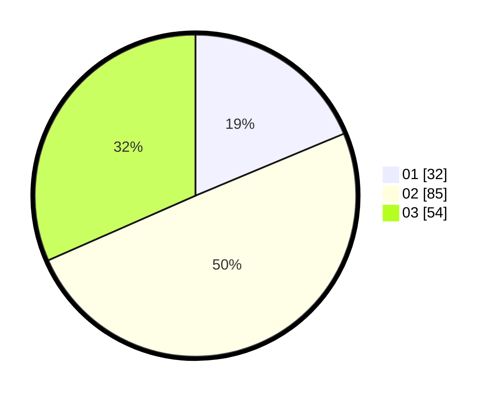

# Hasil

Hasil perolehan suara paslon dapat dilihat pada file paslon-01.txt, paslon-02.txt, dan paslon-03.txt.

Jika tidak ada, artinya data tersebut belum ada pada SIREKAP.

## Perolehan Suara

 * Paslon 01: **32**.
 * Paslon 02: **85**.
 * Paslon 03: **54**.

## Foto C Plano

https://sirekap-obj-formc.kpu.go.id/5710/pemilu/ppwp/31/72/01/10/04/3172011004002-20240216-140710--ccf2d735-2f01-4536-b77b-db9390d24425.jpg

https://sirekap-obj-formc.kpu.go.id/5710/pemilu/ppwp/31/72/01/10/04/3172011004002-20240216-140102--3726a4d7-9ae8-4380-b26c-467b539b8532.jpg

https://sirekap-obj-formc.kpu.go.id/5710/pemilu/ppwp/31/72/01/10/04/3172011004002-20240216-140223--67e187bf-164f-4666-a752-afd4e4206014.jpg

## DATA PEMILIH TETAP

Jumlah pemilih dalam DPT: **250**.
 * L: **123**.
 * P: **127**.

## DATA PENGGUNA HAK PILIH

Jumlah pengguna hak pilih dalam DPT: **168**.
 * L: **82**.
 * P: **86**.

Jumlah pengguna hak pilih dalam DPTb: **3**.
 * L: **3**.
 * P: **0**.

Jumlah pengguna hak pilih dalam DPK: **1**.
 * L: **0**.
 * P: **1**.

Jumlah pengguna hak pilih: **172**.
 * L: **85**.
 * P: **87**.

## JUMLAH SUARA SAH DAN TIDAK SAH

JUMLAH SELURUH SUARA SAH: **171**.

JUMLAH SUARA TIDAK SAH: **1**.

JUMLAH SELURUH SUARA SAH DAN SUARA TIDAK SAH: **172**.
