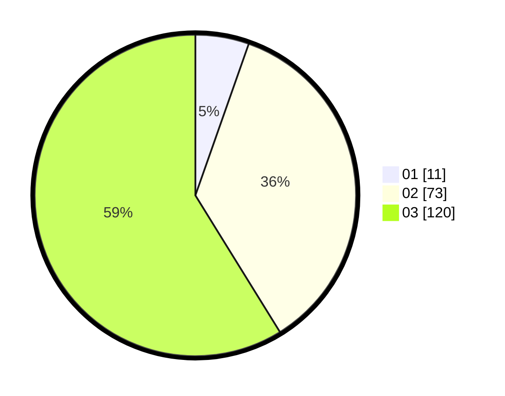

# Hasil

Hasil perolehan suara paslon dapat dilihat pada file paslon-01.txt, paslon-02.txt, dan paslon-03.txt.

Jika tidak ada, artinya data tersebut belum ada pada SIREKAP.

## Perolehan Suara

 * Paslon 01: **11**.
 * Paslon 02: **73**.
 * Paslon 03: **120**.

## Foto C Plano

https://sirekap-obj-formc.kpu.go.id/a02e/pemilu/ppwp/31/72/01/10/04/3172011004004-20240216-181132--3d4b5a37-7fe9-4fcd-9de5-0492e3bd6908.jpg

https://sirekap-obj-formc.kpu.go.id/a02e/pemilu/ppwp/31/72/01/10/04/3172011004004-20240216-181212--7a1f773d-5b82-42dc-b7f5-e13772374a3a.jpg

https://sirekap-obj-formc.kpu.go.id/a02e/pemilu/ppwp/31/72/01/10/04/3172011004004-20240216-181313--092eff2d-c7c9-4255-a189-c172c3e9401e.jpg

## DATA PEMILIH TETAP

Jumlah pemilih dalam DPT: **296**.
 * L: **142**.
 * P: **154**.

## DATA PENGGUNA HAK PILIH

Jumlah pengguna hak pilih dalam DPT: **203**.
 * L: **96**.
 * P: **107**.

Jumlah pengguna hak pilih dalam DPTb: **3**.
 * L: **0**.
 * P: **3**.

Jumlah pengguna hak pilih dalam DPK: **1**.
 * L: **1**.
 * P: **0**.

Jumlah pengguna hak pilih: **207**.
 * L: **97**.
 * P: **110**.

## JUMLAH SUARA SAH DAN TIDAK SAH

JUMLAH SELURUH SUARA SAH: **204**.

JUMLAH SUARA TIDAK SAH: **3**.

JUMLAH SELURUH SUARA SAH DAN SUARA TIDAK SAH: **207**.
