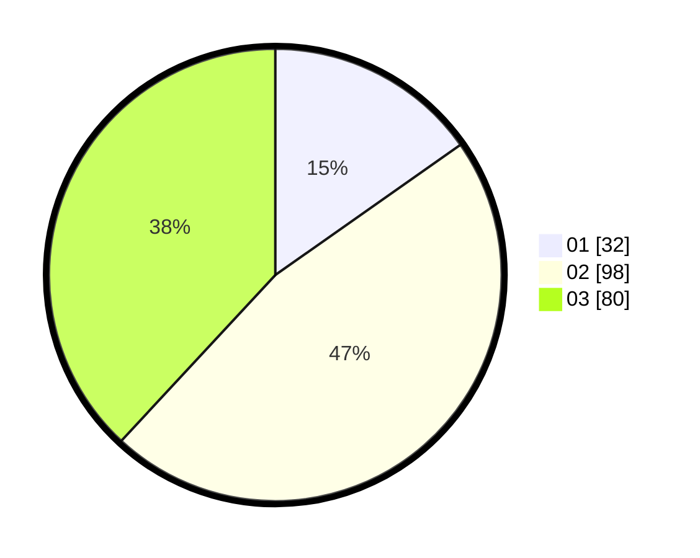

# Hasil

Hasil perolehan suara paslon dapat dilihat pada file paslon-01.txt, paslon-02.txt, dan paslon-03.txt.

Jika tidak ada, artinya data tersebut belum ada pada SIREKAP.

## Perolehan Suara

 * Paslon 01: **32**.
 * Paslon 02: **98**.
 * Paslon 03: **80**.

## Foto C Plano

https://sirekap-obj-formc.kpu.go.id/0bf7/pemilu/ppwp/31/72/01/10/04/3172011004007-20240218-214149--fdc272cb-9a9e-4598-8a0f-9ac07cf2c122.jpg

https://sirekap-obj-formc.kpu.go.id/0bf7/pemilu/ppwp/31/72/01/10/04/3172011004007-20240218-214226--de590d50-6fdc-43d0-aec9-9e9b5481e516.jpg

https://sirekap-obj-formc.kpu.go.id/0bf7/pemilu/ppwp/31/72/01/10/04/3172011004007-20240218-214318--89a36475-4723-49a5-9228-4fc1194d2bc1.jpg

## DATA PEMILIH TETAP

Jumlah pemilih dalam DPT: **287**.
 * L: **146**.
 * P: **141**.

## DATA PENGGUNA HAK PILIH

Jumlah pengguna hak pilih dalam DPT: **201**.
 * L: **107**.
 * P: **94**.

Jumlah pengguna hak pilih dalam DPTb: **3**.
 * L: **3**.
 * P: **0**.

Jumlah pengguna hak pilih dalam DPK: **9**.
 * L: **4**.
 * P: **5**.

Jumlah pengguna hak pilih: **213**.
 * L: **114**.
 * P: **99**.

## JUMLAH SUARA SAH DAN TIDAK SAH

JUMLAH SELURUH SUARA SAH: **210**.

JUMLAH SUARA TIDAK SAH: **3**.

JUMLAH SELURUH SUARA SAH DAN SUARA TIDAK SAH: **213**.
