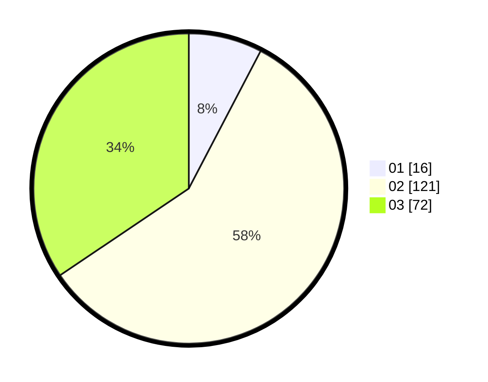

# Hasil

Hasil perolehan suara paslon dapat dilihat pada file paslon-01.txt, paslon-02.txt, dan paslon-03.txt.

Jika tidak ada, artinya data tersebut belum ada pada SIREKAP.

## Perolehan Suara

 * Paslon 01: **16**.
 * Paslon 02: **121**.
 * Paslon 03: **72**.

## Foto C Plano

https://sirekap-obj-formc.kpu.go.id/a3d3/pemilu/ppwp/31/72/01/10/04/3172011004010-20240219-202754--d26abda7-2522-4888-b186-e50a88425aab.jpg

https://sirekap-obj-formc.kpu.go.id/a3d3/pemilu/ppwp/31/72/01/10/04/3172011004010-20240219-202837--8b0f34bd-3afd-429c-92f8-88b0503cec1f.jpg

https://sirekap-obj-formc.kpu.go.id/a3d3/pemilu/ppwp/31/72/01/10/04/3172011004010-20240219-202916--6747b1a3-cb9e-4b08-a38a-ee13267b3b32.jpg

## DATA PEMILIH TETAP

Jumlah pemilih dalam DPT: **300**.
 * L: **135**.
 * P: **165**.

## DATA PENGGUNA HAK PILIH

Jumlah pengguna hak pilih dalam DPT: **212**.
 * L: **97**.
 * P: **115**.

Jumlah pengguna hak pilih dalam DPTb: **0**.
 * L: **0**.
 * P: **0**.

Jumlah pengguna hak pilih dalam DPK: **1**.
 * L: **1**.
 * P: **0**.

Jumlah pengguna hak pilih: **213**.
 * L: **98**.
 * P: **115**.

## JUMLAH SUARA SAH DAN TIDAK SAH

JUMLAH SELURUH SUARA SAH: **209**.

JUMLAH SUARA TIDAK SAH: **4**.

JUMLAH SELURUH SUARA SAH DAN SUARA TIDAK SAH: **213**.
