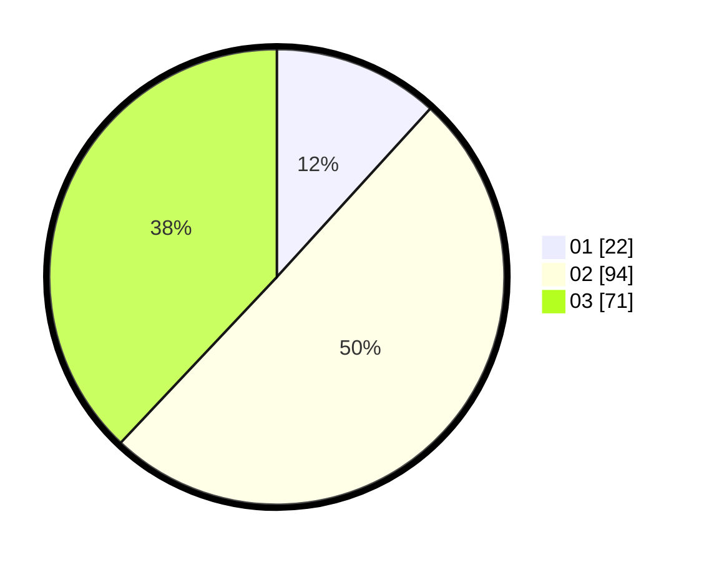

# Hasil

Hasil perolehan suara paslon dapat dilihat pada file paslon-01.txt, paslon-02.txt, dan paslon-03.txt.

Jika tidak ada, artinya data tersebut belum ada pada SIREKAP.

## Perolehan Suara

 * Paslon 01: **22**.
 * Paslon 02: **94**.
 * Paslon 03: **71**.

## Foto C Plano

https://sirekap-obj-formc.kpu.go.id/d3ef/pemilu/ppwp/31/72/01/10/04/3172011004012-20240217-112139--43bc3643-043f-49e4-aea6-a7c37581a0f7.jpg

https://sirekap-obj-formc.kpu.go.id/d3ef/pemilu/ppwp/31/72/01/10/04/3172011004012-20240217-112211--bef21e92-be04-4346-adf8-aa02b5b17866.jpg

https://sirekap-obj-formc.kpu.go.id/d3ef/pemilu/ppwp/31/72/01/10/04/3172011004012-20240217-112242--6fb9d46d-ae75-4169-8c57-05812e8b4ceb.jpg

## DATA PEMILIH TETAP

Jumlah pemilih dalam DPT: **294**.
 * L: **158**.
 * P: **136**.

## DATA PENGGUNA HAK PILIH

Jumlah pengguna hak pilih dalam DPT: **185**.
 * L: **89**.
 * P: **96**.

Jumlah pengguna hak pilih dalam DPTb: **2**.
 * L: **2**.
 * P: **0**.

Jumlah pengguna hak pilih dalam DPK: **1**.
 * L: **0**.
 * P: **1**.

Jumlah pengguna hak pilih: **188**.
 * L: **91**.
 * P: **97**.

## JUMLAH SUARA SAH DAN TIDAK SAH

JUMLAH SELURUH SUARA SAH: **187**.

JUMLAH SUARA TIDAK SAH: **1**.

JUMLAH SELURUH SUARA SAH DAN SUARA TIDAK SAH: **148**.
