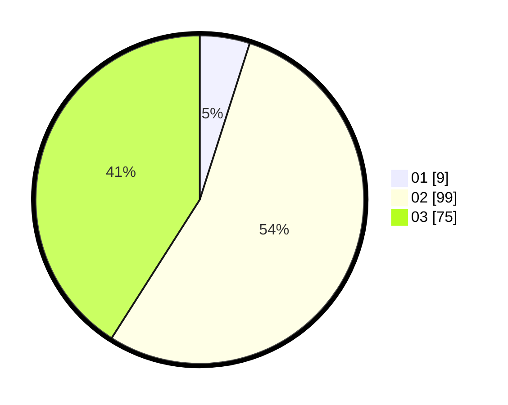

# Hasil

Hasil perolehan suara paslon dapat dilihat pada file paslon-01.txt, paslon-02.txt, dan paslon-03.txt.

Jika tidak ada, artinya data tersebut belum ada pada SIREKAP.

## Perolehan Suara

 * Paslon 01: **9**.
 * Paslon 02: **99**.
 * Paslon 03: **75**.

## Foto C Plano

https://sirekap-obj-formc.kpu.go.id/16e5/pemilu/ppwp/31/72/01/10/04/3172011004017-20240217-113036--0ec5cbdb-1e9c-4bea-bb4a-4e9315b856df.jpg

https://sirekap-obj-formc.kpu.go.id/16e5/pemilu/ppwp/31/72/01/10/04/3172011004017-20240217-113126--22fb9f06-e996-4e61-9fee-348b2271c846.jpg

https://sirekap-obj-formc.kpu.go.id/16e5/pemilu/ppwp/31/72/01/10/04/3172011004017-20240217-113157--e3185953-2468-4768-a8d0-7ae9db270f3e.jpg

## DATA PEMILIH TETAP

Jumlah pemilih dalam DPT: **294**.
 * L: **144**.
 * P: **156**.

## DATA PENGGUNA HAK PILIH

Jumlah pengguna hak pilih dalam DPT: **172**.
 * L: **75**.
 * P: **87**.

Jumlah pengguna hak pilih dalam DPTb: **409**.
 * L: **2**.
 * P: **207**.

Jumlah pengguna hak pilih dalam DPK: **2**.
 * L: **4**.
 * P: **2**.

Jumlah pengguna hak pilih: **183**.
 * L: **885**.
 * P: **885**.

## JUMLAH SUARA SAH DAN TIDAK SAH

JUMLAH SELURUH SUARA SAH: **583**.

JUMLAH SUARA TIDAK SAH: **0**.

JUMLAH SELURUH SUARA SAH DAN SUARA TIDAK SAH: **183**.
