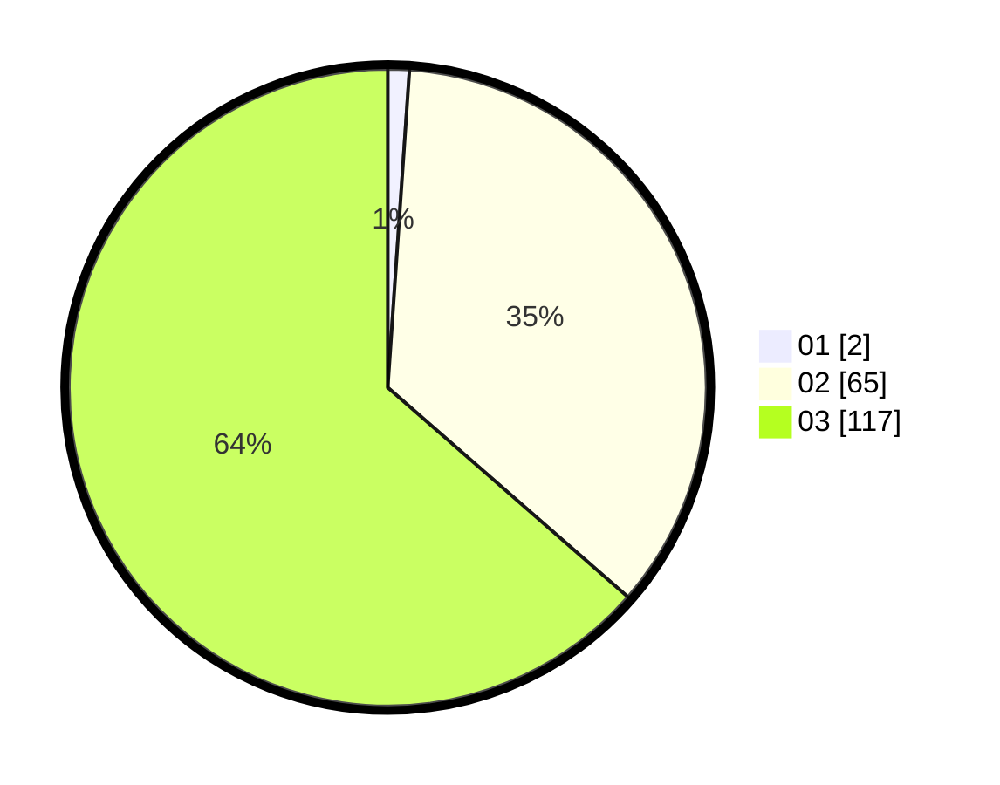

# Hasil

Hasil perolehan suara paslon dapat dilihat pada file paslon-01.txt, paslon-02.txt, dan paslon-03.txt.

Jika tidak ada, artinya data tersebut belum ada pada SIREKAP.

## Perolehan Suara

 * Paslon 01: **2**.
 * Paslon 02: **65**.
 * Paslon 03: **117**.

## Foto C Plano

https://sirekap-obj-formc.kpu.go.id/5a96/pemilu/ppwp/31/72/01/10/04/3172011004019-20240217-112642--3bbbd4c1-8250-4c39-b23d-5eccf966c660.jpg

https://sirekap-obj-formc.kpu.go.id/5a96/pemilu/ppwp/31/72/01/10/04/3172011004019-20240217-112747--e4cbd574-d96f-4f0b-aa7e-7e51e7bcf7ed.jpg

https://sirekap-obj-formc.kpu.go.id/5a96/pemilu/ppwp/31/72/01/10/04/3172011004019-20240217-112816--feec5eae-e748-45b8-b70f-3f9b5421dc30.jpg

## DATA PEMILIH TETAP

Jumlah pemilih dalam DPT: **252**.
 * L: **120**.
 * P: **132**.

## DATA PENGGUNA HAK PILIH

Jumlah pengguna hak pilih dalam DPT: **185**.
 * L: **89**.
 * P: **96**.

Jumlah pengguna hak pilih dalam DPTb: **2**.
 * L: **0**.
 * P: **2**.

Jumlah pengguna hak pilih dalam DPK: **0**.
 * L: **0**.
 * P: **0**.

Jumlah pengguna hak pilih: **187**.
 * L: **89**.
 * P: **98**.

## JUMLAH SUARA SAH DAN TIDAK SAH

JUMLAH SELURUH SUARA SAH: **184**.

JUMLAH SUARA TIDAK SAH: **3**.

JUMLAH SELURUH SUARA SAH DAN SUARA TIDAK SAH: **187**.
