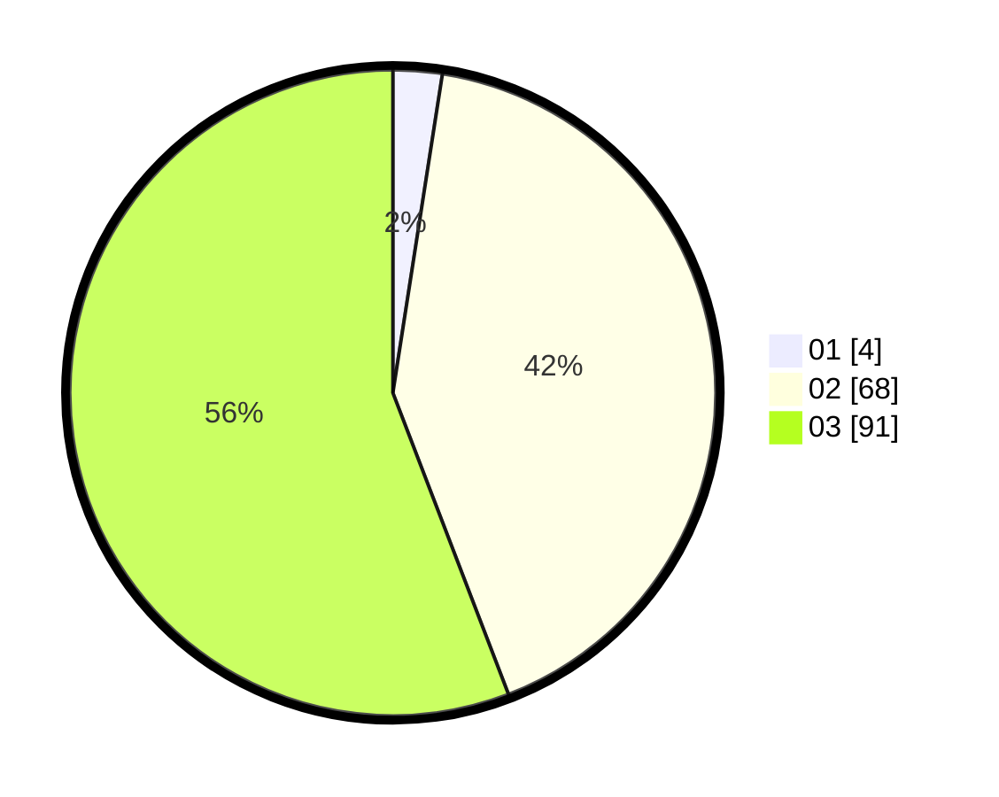

# Hasil

Hasil perolehan suara paslon dapat dilihat pada file paslon-01.txt, paslon-02.txt, dan paslon-03.txt.

Jika tidak ada, artinya data tersebut belum ada pada SIREKAP.

## Perolehan Suara

 * Paslon 01: **4**.
 * Paslon 02: **68**.
 * Paslon 03: **91**.

## Foto C Plano

https://sirekap-obj-formc.kpu.go.id/a9c1/pemilu/ppwp/31/72/01/10/04/3172011004020-20240217-113449--a6cf2a26-e9e0-43f9-866b-55c595ca5c7d.jpg

https://sirekap-obj-formc.kpu.go.id/a9c1/pemilu/ppwp/31/72/01/10/04/3172011004020-20240217-113511--15f5dbfb-2337-419d-b435-67dc2d58d815.jpg

https://sirekap-obj-formc.kpu.go.id/a9c1/pemilu/ppwp/31/72/01/10/04/3172011004020-20240217-113529--a0a33b5e-75a4-4570-a4c1-25027ada573e.jpg

## DATA PEMILIH TETAP

Jumlah pemilih dalam DPT: **235**.
 * L: **701**.
 * P: **134**.

## DATA PENGGUNA HAK PILIH

Jumlah pengguna hak pilih dalam DPT: **167**.
 * L: **70**.
 * P: **97**.

Jumlah pengguna hak pilih dalam DPTb: **0**.
 * L: **0**.
 * P: **0**.

Jumlah pengguna hak pilih dalam DPK: **1**.
 * L: **1**.
 * P: **0**.

Jumlah pengguna hak pilih: **160**.
 * L: **71**.
 * P: **97**.

## JUMLAH SUARA SAH DAN TIDAK SAH

JUMLAH SELURUH SUARA SAH: **163**.

JUMLAH SUARA TIDAK SAH: **5**.

JUMLAH SELURUH SUARA SAH DAN SUARA TIDAK SAH: **168**.
