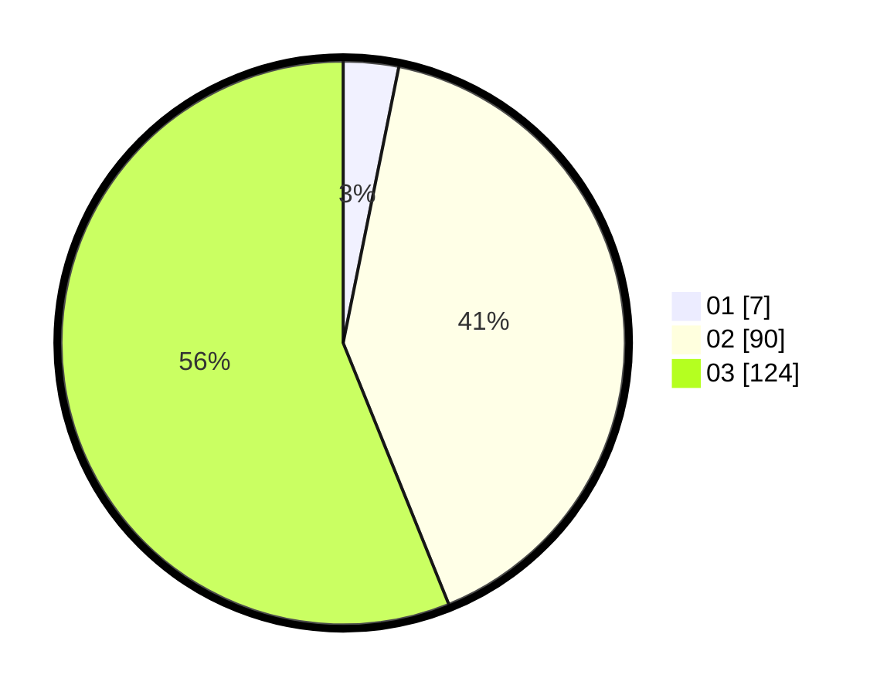

# Hasil

Hasil perolehan suara paslon dapat dilihat pada file paslon-01.txt, paslon-02.txt, dan paslon-03.txt.

Jika tidak ada, artinya data tersebut belum ada pada SIREKAP.

## Perolehan Suara

 * Paslon 01: **7**.
 * Paslon 02: **90**.
 * Paslon 03: **124**.

## Foto C Plano

https://sirekap-obj-formc.kpu.go.id/afe3/pemilu/ppwp/31/72/01/10/04/3172011004023-20240217-114059--4a0729c6-b89e-4f6f-adc8-a06df7446f7d.jpg

https://sirekap-obj-formc.kpu.go.id/afe3/pemilu/ppwp/31/72/01/10/04/3172011004023-20240217-114121--522dd634-ad3f-4e66-abdb-aeeb6def84a5.jpg

https://sirekap-obj-formc.kpu.go.id/afe3/pemilu/ppwp/31/72/01/10/04/3172011004023-20240217-114150--3dd1c358-64b7-4d43-8de4-5df042bd6803.jpg

## DATA PEMILIH TETAP

Jumlah pemilih dalam DPT: **289**.
 * L: **142**.
 * P: **147**.

## DATA PENGGUNA HAK PILIH

Jumlah pengguna hak pilih dalam DPT: **872**.
 * L: **209**.
 * P: **613**.

Jumlah pengguna hak pilih dalam DPTb: **3**.
 * L: **2**.
 * P: **1**.

Jumlah pengguna hak pilih dalam DPK: **6**.
 * L: **2**.
 * P: **4**.

Jumlah pengguna hak pilih: **226**.
 * L: **508**.
 * P: **118**.

## JUMLAH SUARA SAH DAN TIDAK SAH

JUMLAH SELURUH SUARA SAH: **221**.

JUMLAH SUARA TIDAK SAH: **5**.

JUMLAH SELURUH SUARA SAH DAN SUARA TIDAK SAH: **226**.
