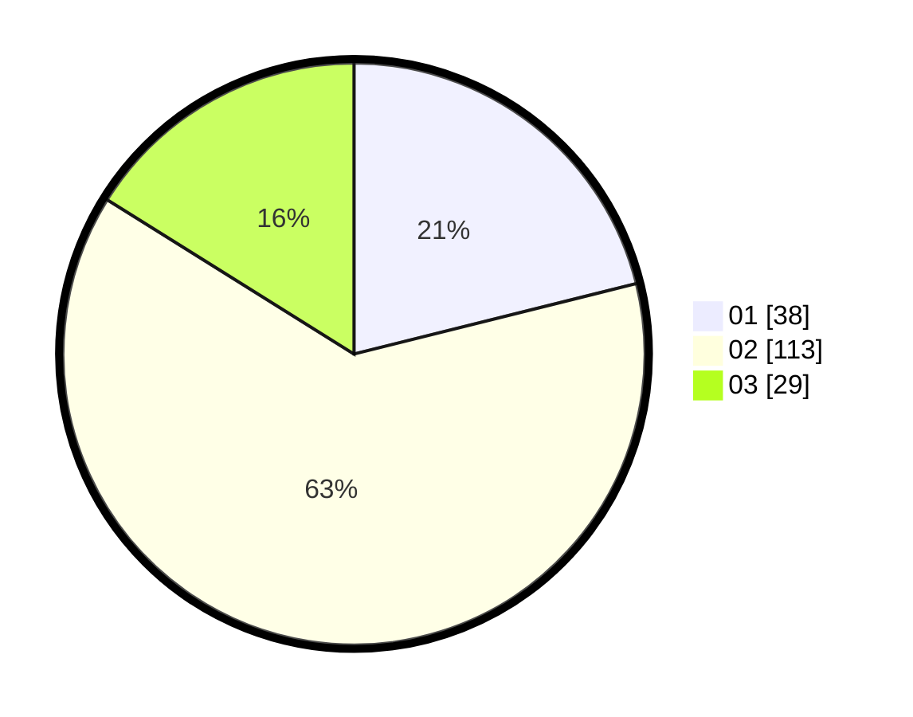

# Hasil

Hasil perolehan suara paslon dapat dilihat pada file paslon-01.txt, paslon-02.txt, dan paslon-03.txt.

Jika tidak ada, artinya data tersebut belum ada pada SIREKAP.

## Perolehan Suara

 * Paslon 01: **38**.
 * Paslon 02: **113**.
 * Paslon 03: **29**.

## Foto C Plano

https://sirekap-obj-formc.kpu.go.id/b97a/pemilu/ppwp/31/72/01/10/04/3172011004027-20240217-115625--13b98aa6-bad8-4b6a-a89a-5ce0b8e91750.jpg

https://sirekap-obj-formc.kpu.go.id/b97a/pemilu/ppwp/31/72/01/10/04/3172011004027-20240217-115735--81f6a12c-a4ea-4362-924c-cba76ec1e61f.jpg

https://sirekap-obj-formc.kpu.go.id/b97a/pemilu/ppwp/31/72/01/10/04/3172011004027-20240217-115544--bf228ce1-be07-4c87-92eb-6e9f1bfac24b.jpg

## DATA PEMILIH TETAP

Jumlah pemilih dalam DPT: **291**.
 * L: **150**.
 * P: **141**.

## DATA PENGGUNA HAK PILIH

Jumlah pengguna hak pilih dalam DPT: **26**.
 * L: **222**.
 * P: **233**.

Jumlah pengguna hak pilih dalam DPTb: **0**.
 * L: **0**.
 * P: **0**.

Jumlah pengguna hak pilih dalam DPK: **1**.
 * L: **1**.
 * P: **0**.

Jumlah pengguna hak pilih: **4**.
 * L: **788**.
 * P: **0**.

## JUMLAH SUARA SAH DAN TIDAK SAH

JUMLAH SELURUH SUARA SAH: **180**.

JUMLAH SUARA TIDAK SAH: **4**.

JUMLAH SELURUH SUARA SAH DAN SUARA TIDAK SAH: **184**.
