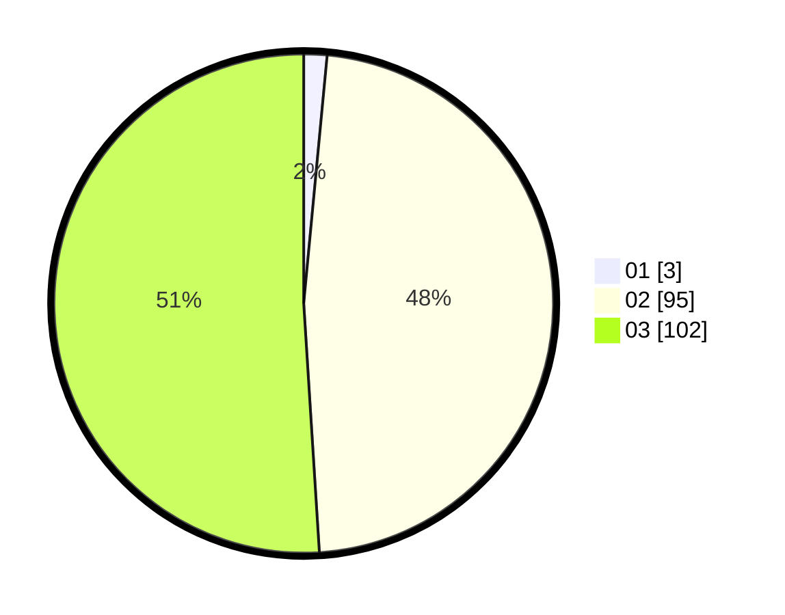

# Hasil

Hasil perolehan suara paslon dapat dilihat pada file paslon-01.txt, paslon-02.txt, dan paslon-03.txt.

Jika tidak ada, artinya data tersebut belum ada pada SIREKAP.

## Perolehan Suara

 * Paslon 01: **3**.
 * Paslon 02: **95**.
 * Paslon 03: **102**.

## Foto C Plano

https://sirekap-obj-formc.kpu.go.id/09be/pemilu/ppwp/31/72/01/10/04/3172011004046-20240215-104159--b04920a9-6180-4b4b-865f-c36edcfd2e64.jpg

https://sirekap-obj-formc.kpu.go.id/09be/pemilu/ppwp/31/72/01/10/04/3172011004046-20240215-104221--7db026b4-e078-471b-a2ec-b86d70b56e87.jpg

https://sirekap-obj-formc.kpu.go.id/09be/pemilu/ppwp/31/72/01/10/04/3172011004046-20240215-104210--91e31822-39d7-408e-a0da-403af23ad4d3.jpg

## DATA PEMILIH TETAP

Jumlah pemilih dalam DPT: **0**.
 * L: **0**.
 * P: **0**.

## DATA PENGGUNA HAK PILIH

Jumlah pengguna hak pilih dalam DPT: **0**.
 * L: **0**.
 * P: **0**.

Jumlah pengguna hak pilih dalam DPTb: **0**.
 * L: **0**.
 * P: **0**.

Jumlah pengguna hak pilih dalam DPK: **0**.
 * L: **0**.
 * P: **0**.

Jumlah pengguna hak pilih: **0**.
 * L: **0**.
 * P: **0**.

## JUMLAH SUARA SAH DAN TIDAK SAH

JUMLAH SELURUH SUARA SAH: **200**.

JUMLAH SUARA TIDAK SAH: **1**.

JUMLAH SELURUH SUARA SAH DAN SUARA TIDAK SAH: **201**.
