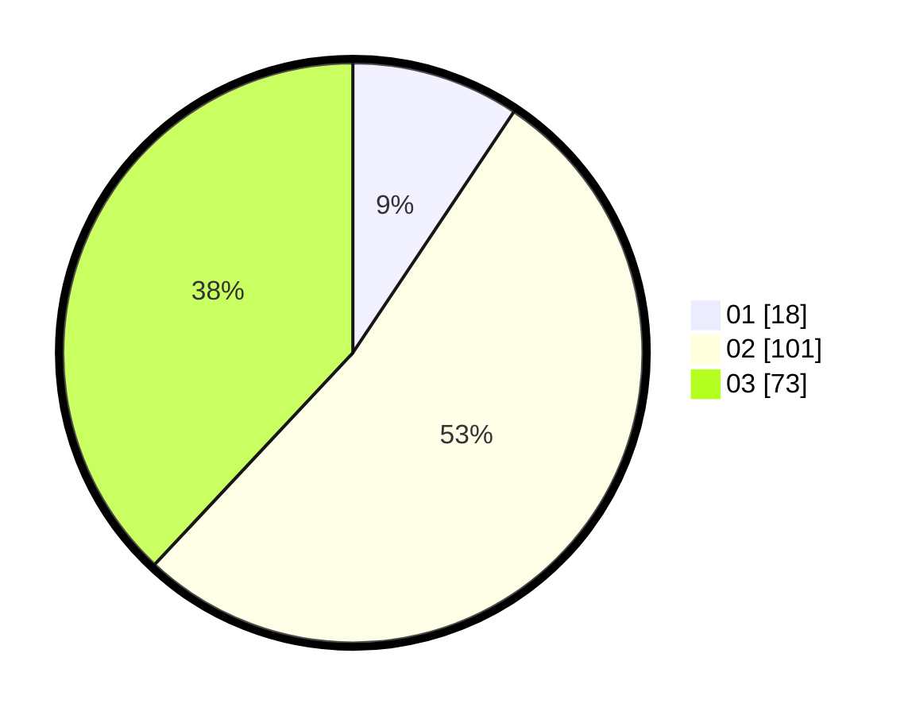

# Hasil

Hasil perolehan suara paslon dapat dilihat pada file paslon-01.txt, paslon-02.txt, dan paslon-03.txt.

Jika tidak ada, artinya data tersebut belum ada pada SIREKAP.

## Perolehan Suara

 * Paslon 01: **18**.
 * Paslon 02: **101**.
 * Paslon 03: **73**.

## Foto C Plano

https://sirekap-obj-formc.kpu.go.id/05be/pemilu/ppwp/31/72/01/10/04/3172011004060-20240214-200810--e95bccc2-6180-4c88-865f-56ec8170fb57.jpg

https://sirekap-obj-formc.kpu.go.id/05be/pemilu/ppwp/31/72/01/10/04/3172011004060-20240214-200909--ff3b60eb-6485-4431-a5e8-841fa2b15f30.jpg

https://sirekap-obj-formc.kpu.go.id/05be/pemilu/ppwp/31/72/01/10/04/3172011004060-20240214-201329--98a28d13-186d-48d7-b5ff-019ef3e239a8.jpg

## DATA PEMILIH TETAP

Jumlah pemilih dalam DPT: **289**.
 * L: **148**.
 * P: **141**.

## DATA PENGGUNA HAK PILIH

Jumlah pengguna hak pilih dalam DPT: **197**.
 * L: **94**.
 * P: **103**.

Jumlah pengguna hak pilih dalam DPTb: **0**.
 * L: **0**.
 * P: **0**.

Jumlah pengguna hak pilih dalam DPK: **1**.
 * L: **0**.
 * P: **1**.

Jumlah pengguna hak pilih: **198**.
 * L: **94**.
 * P: **104**.

## JUMLAH SUARA SAH DAN TIDAK SAH

JUMLAH SELURUH SUARA SAH: **192**.

JUMLAH SUARA TIDAK SAH: **6**.

JUMLAH SELURUH SUARA SAH DAN SUARA TIDAK SAH: **198**.
