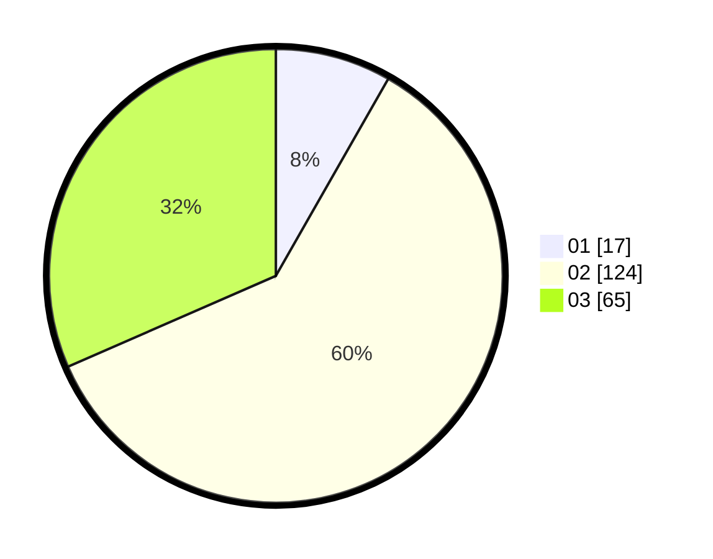

# Hasil

Hasil perolehan suara paslon dapat dilihat pada file paslon-01.txt, paslon-02.txt, dan paslon-03.txt.

Jika tidak ada, artinya data tersebut belum ada pada SIREKAP.

## Perolehan Suara

 * Paslon 01: **17**.
 * Paslon 02: **124**.
 * Paslon 03: **65**.

## Foto C Plano

https://sirekap-obj-formc.kpu.go.id/33f6/pemilu/ppwp/31/72/01/10/04/3172011004068-20240215-204151--fa8ff6cf-b931-4969-9deb-243ed5dd92ea.jpg

https://sirekap-obj-formc.kpu.go.id/33f6/pemilu/ppwp/31/72/01/10/04/3172011004068-20240216-175803--4f9dba22-41d5-4c7e-ad02-50fe8a4f61da.jpg

https://sirekap-obj-formc.kpu.go.id/33f6/pemilu/ppwp/31/72/01/10/04/3172011004068-20240215-203038--86aff9dc-c355-43d5-a3d1-ee1b69f4e3a9.jpg

## DATA PEMILIH TETAP

Jumlah pemilih dalam DPT: **285**.
 * L: **135**.
 * P: **150**.

## DATA PENGGUNA HAK PILIH

Jumlah pengguna hak pilih dalam DPT: **206**.
 * L: **93**.
 * P: **113**.

Jumlah pengguna hak pilih dalam DPTb: **0**.
 * L: **0**.
 * P: **0**.

Jumlah pengguna hak pilih dalam DPK: **2**.
 * L: **1**.
 * P: **1**.

Jumlah pengguna hak pilih: **208**.
 * L: **94**.
 * P: **114**.

## JUMLAH SUARA SAH DAN TIDAK SAH

JUMLAH SELURUH SUARA SAH: **206**.

JUMLAH SUARA TIDAK SAH: **2**.

JUMLAH SELURUH SUARA SAH DAN SUARA TIDAK SAH: **208**.
