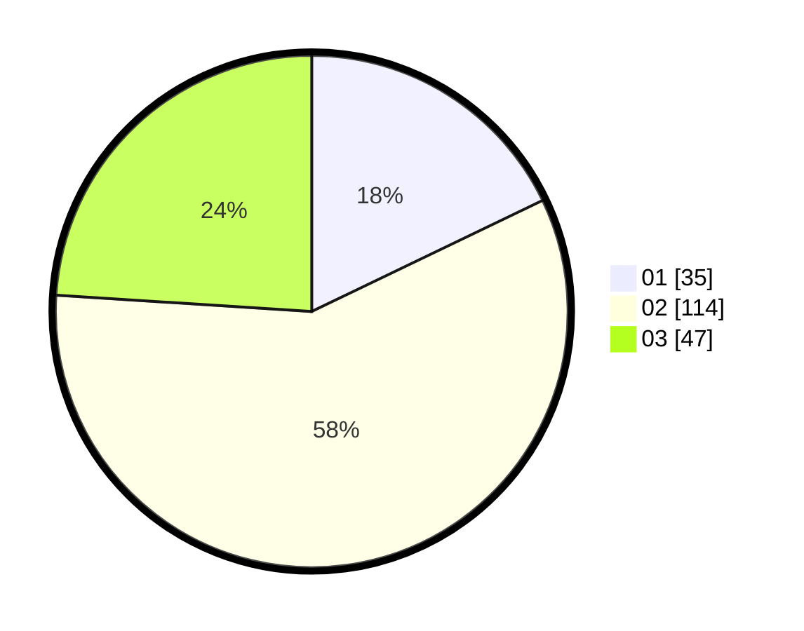

# Hasil

Hasil perolehan suara paslon dapat dilihat pada file paslon-01.txt, paslon-02.txt, dan paslon-03.txt.

Jika tidak ada, artinya data tersebut belum ada pada SIREKAP.

## Perolehan Suara

 * Paslon 01: **35**.
 * Paslon 02: **114**.
 * Paslon 03: **47**.

## Foto C Plano

https://sirekap-obj-formc.kpu.go.id/6bae/pemilu/ppwp/31/72/01/10/04/3172011004081-20240214-155104--c57a76dd-c49c-4794-a981-ae964048b1b1.jpg

https://sirekap-obj-formc.kpu.go.id/6bae/pemilu/ppwp/31/72/01/10/04/3172011004081-20240214-155115--69ed4bf8-084c-4816-bc82-5aab8509459a.jpg

https://sirekap-obj-formc.kpu.go.id/6bae/pemilu/ppwp/31/72/01/10/04/3172011004081-20240214-155124--9982ef96-c358-4eae-82a1-711e7072e5e6.jpg

## DATA PEMILIH TETAP

Jumlah pemilih dalam DPT: **279**.
 * L: **133**.
 * P: **146**.

## DATA PENGGUNA HAK PILIH

Jumlah pengguna hak pilih dalam DPT: **197**.
 * L: **91**.
 * P: **106**.

Jumlah pengguna hak pilih dalam DPTb: **0**.
 * L: **0**.
 * P: **0**.

Jumlah pengguna hak pilih dalam DPK: **4**.
 * L: **2**.
 * P: **2**.

Jumlah pengguna hak pilih: **201**.
 * L: **93**.
 * P: **108**.

## JUMLAH SUARA SAH DAN TIDAK SAH

JUMLAH SELURUH SUARA SAH: **196**.

JUMLAH SUARA TIDAK SAH: **5**.

JUMLAH SELURUH SUARA SAH DAN SUARA TIDAK SAH: **201**.
