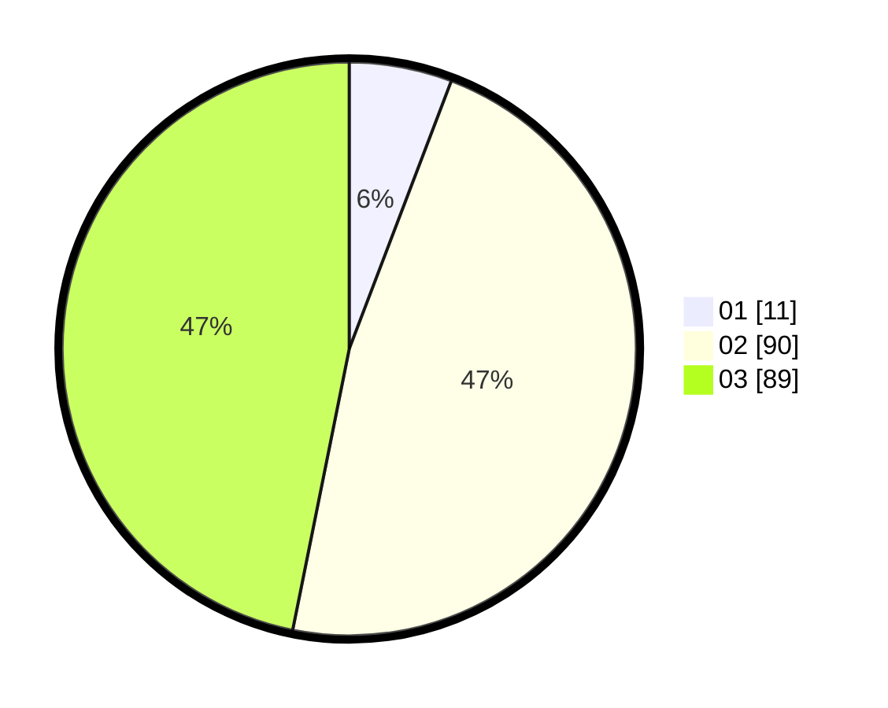

# Hasil

Hasil perolehan suara paslon dapat dilihat pada file paslon-01.txt, paslon-02.txt, dan paslon-03.txt.

Jika tidak ada, artinya data tersebut belum ada pada SIREKAP.

## Perolehan Suara

 * Paslon 01: **11**.
 * Paslon 02: **90**.
 * Paslon 03: **89**.

## Foto C Plano

https://sirekap-obj-formc.kpu.go.id/e101/pemilu/ppwp/31/72/01/10/04/3172011004098-20240214-232107--dfee1f36-9073-484f-9fa1-9bb5224d1e5a.jpg

https://sirekap-obj-formc.kpu.go.id/e101/pemilu/ppwp/31/72/01/10/04/3172011004098-20240214-194232--28c18487-bb54-47f3-bc51-fb59e31d5a83.jpg

https://sirekap-obj-formc.kpu.go.id/e101/pemilu/ppwp/31/72/01/10/04/3172011004098-20240214-232912--60c192fd-3e75-4e71-806f-f7de0196d911.jpg

## DATA PEMILIH TETAP

Jumlah pemilih dalam DPT: **290**.
 * L: **148**.
 * P: **142**.

## DATA PENGGUNA HAK PILIH

Jumlah pengguna hak pilih dalam DPT: **194**.
 * L: **101**.
 * P: **93**.

Jumlah pengguna hak pilih dalam DPTb: **1**.
 * L: **0**.
 * P: **1**.

Jumlah pengguna hak pilih dalam DPK: **0**.
 * L: **0**.
 * P: **0**.

Jumlah pengguna hak pilih: **195**.
 * L: **101**.
 * P: **94**.

## JUMLAH SUARA SAH DAN TIDAK SAH

JUMLAH SELURUH SUARA SAH: **190**.

JUMLAH SUARA TIDAK SAH: **5**.

JUMLAH SELURUH SUARA SAH DAN SUARA TIDAK SAH: **195**.
