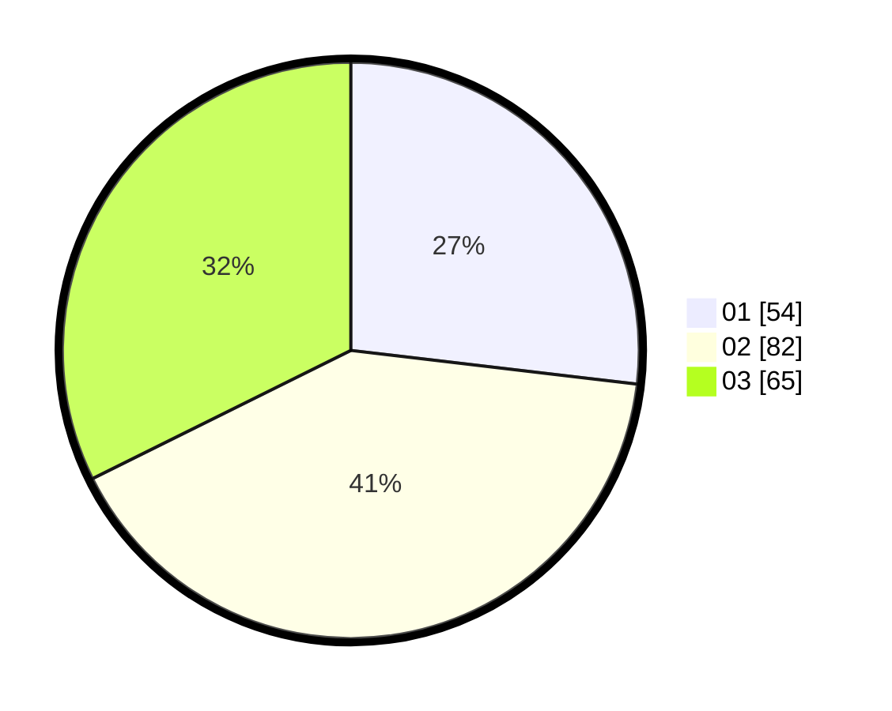

# Hasil

Hasil perolehan suara paslon dapat dilihat pada file paslon-01.txt, paslon-02.txt, dan paslon-03.txt.

Jika tidak ada, artinya data tersebut belum ada pada SIREKAP.

## Perolehan Suara

 * Paslon 01: **54**.
 * Paslon 02: **82**.
 * Paslon 03: **65**.

## Foto C Plano

https://sirekap-obj-formc.kpu.go.id/b244/pemilu/ppwp/31/72/01/10/04/3172011004100-20240214-155839--4cf8627d-32c9-4960-aec9-f45115db5d89.jpg

https://sirekap-obj-formc.kpu.go.id/b244/pemilu/ppwp/31/72/01/10/04/3172011004100-20240214-160103--90eec964-5776-49d1-85af-7426896f048b.jpg

https://sirekap-obj-formc.kpu.go.id/b244/pemilu/ppwp/31/72/01/10/04/3172011004100-20240214-160156--7995406e-25a8-4929-b4db-9fd2631aecf4.jpg

## DATA PEMILIH TETAP

Jumlah pemilih dalam DPT: **289**.
 * L: **157**.
 * P: **132**.

## DATA PENGGUNA HAK PILIH

Jumlah pengguna hak pilih dalam DPT: **206**.
 * L: **110**.
 * P: **96**.

Jumlah pengguna hak pilih dalam DPTb: **0**.
 * L: **0**.
 * P: **0**.

Jumlah pengguna hak pilih dalam DPK: **0**.
 * L: **0**.
 * P: **0**.

Jumlah pengguna hak pilih: **206**.
 * L: **110**.
 * P: **96**.

## JUMLAH SUARA SAH DAN TIDAK SAH

JUMLAH SELURUH SUARA SAH: **201**.

JUMLAH SUARA TIDAK SAH: **5**.

JUMLAH SELURUH SUARA SAH DAN SUARA TIDAK SAH: **206**.
