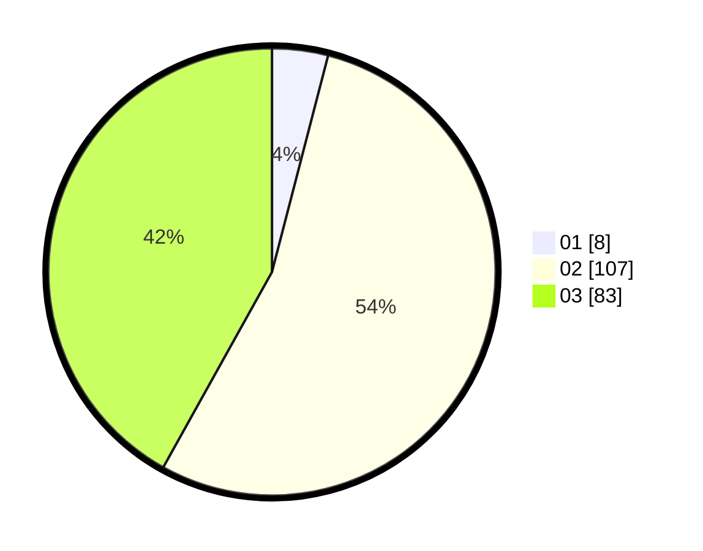

# Hasil

Hasil perolehan suara paslon dapat dilihat pada file paslon-01.txt, paslon-02.txt, dan paslon-03.txt.

Jika tidak ada, artinya data tersebut belum ada pada SIREKAP.

## Perolehan Suara

 * Paslon 01: **8**.
 * Paslon 02: **107**.
 * Paslon 03: **83**.

## Foto C Plano

https://sirekap-obj-formc.kpu.go.id/f0cd/pemilu/ppwp/31/72/01/10/04/3172011004120-20240214-224052--0362ddd1-6925-4e57-acda-018345c2f1a2.jpg

https://sirekap-obj-formc.kpu.go.id/f0cd/pemilu/ppwp/31/72/01/10/04/3172011004120-20240214-224142--9a5c00e1-11d8-4e34-84f6-c81d05421d92.jpg

https://sirekap-obj-formc.kpu.go.id/f0cd/pemilu/ppwp/31/72/01/10/04/3172011004120-20240214-224215--b4f8c1df-ecad-43b8-92ee-3d4c54977bae.jpg

## DATA PEMILIH TETAP

Jumlah pemilih dalam DPT: **289**.
 * L: **157**.
 * P: **132**.

## DATA PENGGUNA HAK PILIH

Jumlah pengguna hak pilih dalam DPT: **202**.
 * L: **104**.
 * P: **98**.

Jumlah pengguna hak pilih dalam DPTb: **0**.
 * L: **0**.
 * P: **0**.

Jumlah pengguna hak pilih dalam DPK: **1**.
 * L: **1**.
 * P: **0**.

Jumlah pengguna hak pilih: **203**.
 * L: **105**.
 * P: **98**.

## JUMLAH SUARA SAH DAN TIDAK SAH

JUMLAH SELURUH SUARA SAH: **198**.

JUMLAH SUARA TIDAK SAH: **5**.

JUMLAH SELURUH SUARA SAH DAN SUARA TIDAK SAH: **203**.
