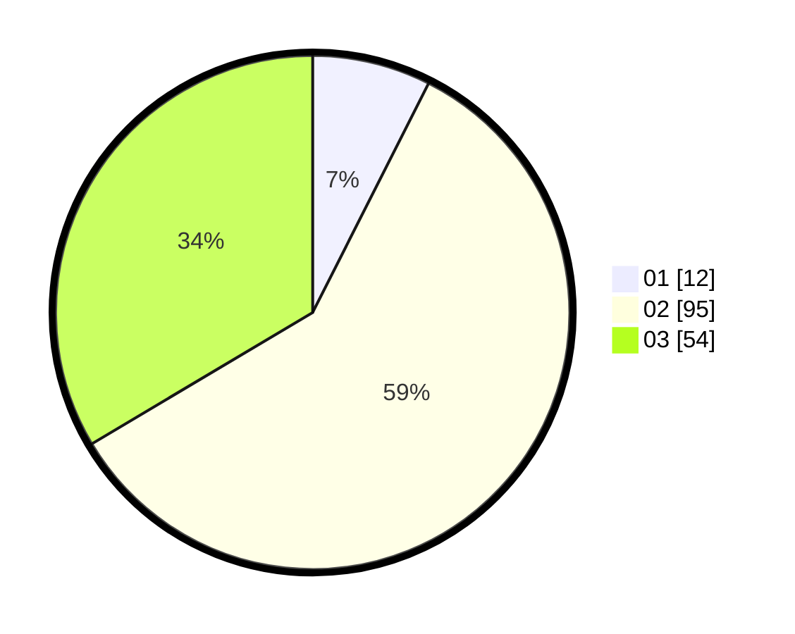

# Hasil

Hasil perolehan suara paslon dapat dilihat pada file paslon-01.txt, paslon-02.txt, dan paslon-03.txt.

Jika tidak ada, artinya data tersebut belum ada pada SIREKAP.

## Perolehan Suara

 * Paslon 01: **12**.
 * Paslon 02: **95**.
 * Paslon 03: **54**.

## Foto C Plano

https://sirekap-obj-formc.kpu.go.id/fa7f/pemilu/ppwp/31/72/01/10/04/3172011004121-20240215-001759--3755e85b-e5e9-4246-8712-c1d0100746f3.jpg

https://sirekap-obj-formc.kpu.go.id/fa7f/pemilu/ppwp/31/72/01/10/04/3172011004121-20240214-220100--70600c47-a6d0-46e1-bd37-70edfb8230ce.jpg

https://sirekap-obj-formc.kpu.go.id/fa7f/pemilu/ppwp/31/72/01/10/04/3172011004121-20240214-220254--ff58427a-0b1a-49f7-ab78-5559af87ff10.jpg

## DATA PEMILIH TETAP

Jumlah pemilih dalam DPT: **229**.
 * L: **113**.
 * P: **116**.

## DATA PENGGUNA HAK PILIH

Jumlah pengguna hak pilih dalam DPT: **161**.
 * L: **79**.
 * P: **82**.

Jumlah pengguna hak pilih dalam DPTb: **0**.
 * L: **0**.
 * P: **0**.

Jumlah pengguna hak pilih dalam DPK: **2**.
 * L: **1**.
 * P: **1**.

Jumlah pengguna hak pilih: **163**.
 * L: **80**.
 * P: **83**.

## JUMLAH SUARA SAH DAN TIDAK SAH

JUMLAH SELURUH SUARA SAH: **161**.

JUMLAH SUARA TIDAK SAH: **2**.

JUMLAH SELURUH SUARA SAH DAN SUARA TIDAK SAH: **163**.
