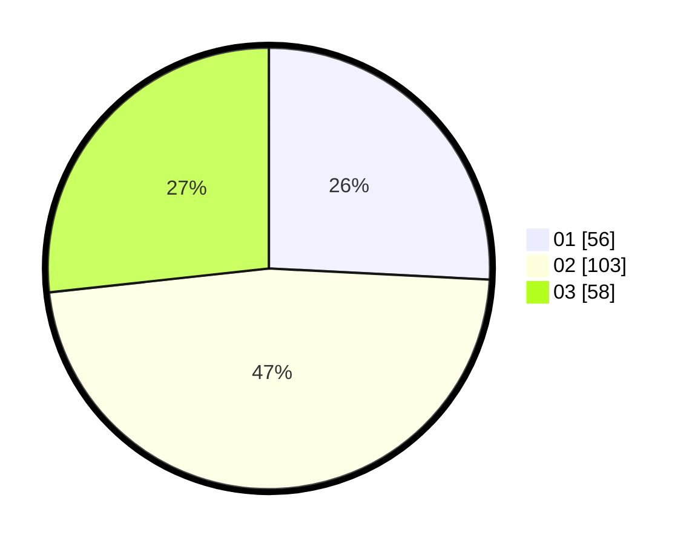

# Hasil

Hasil perolehan suara paslon dapat dilihat pada file paslon-01.txt, paslon-02.txt, dan paslon-03.txt.

Jika tidak ada, artinya data tersebut belum ada pada SIREKAP.

## Perolehan Suara

 * Paslon 01: **56**.
 * Paslon 02: **103**.
 * Paslon 03: **58**.

## Foto C Plano

https://sirekap-obj-formc.kpu.go.id/1af2/pemilu/ppwp/31/72/01/10/04/3172011004168-20240216-024248--c341b8ae-173c-4a01-bcb1-48de9615cb40.jpg

https://sirekap-obj-formc.kpu.go.id/1af2/pemilu/ppwp/31/72/01/10/04/3172011004168-20240216-024251--2973ebac-05dd-4a77-8b0b-45d4ada47236.jpg

https://sirekap-obj-formc.kpu.go.id/1af2/pemilu/ppwp/31/72/01/10/04/3172011004168-20240216-024249--83a241ab-f545-4e40-a3d5-cb33a3c82599.jpg

## DATA PEMILIH TETAP

Jumlah pemilih dalam DPT: **288**.
 * L: **144**.
 * P: **144**.

## DATA PENGGUNA HAK PILIH

Jumlah pengguna hak pilih dalam DPT: **212**.
 * L: **109**.
 * P: **103**.

Jumlah pengguna hak pilih dalam DPTb: **7**.
 * L: **1**.
 * P: **6**.

Jumlah pengguna hak pilih dalam DPK: **0**.
 * L: **0**.
 * P: **0**.

Jumlah pengguna hak pilih: **219**.
 * L: **110**.
 * P: **109**.

## JUMLAH SUARA SAH DAN TIDAK SAH

JUMLAH SELURUH SUARA SAH: **217**.

JUMLAH SUARA TIDAK SAH: **2**.

JUMLAH SELURUH SUARA SAH DAN SUARA TIDAK SAH: **219**.
