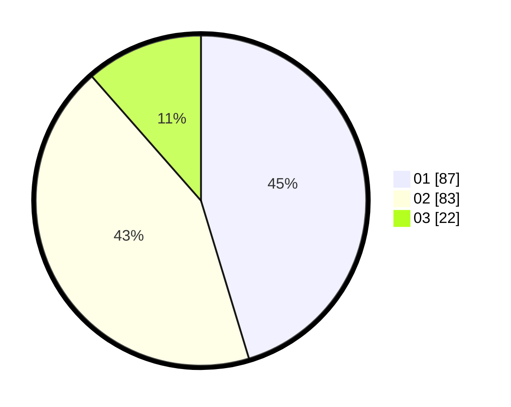

# Hasil

Hasil perolehan suara paslon dapat dilihat pada file paslon-01.txt, paslon-02.txt, dan paslon-03.txt.

Jika tidak ada, artinya data tersebut belum ada pada SIREKAP.

## Perolehan Suara

 * Paslon 01: **87**.
 * Paslon 02: **83**.
 * Paslon 03: **22**.

## Foto C Plano

https://sirekap-obj-formc.kpu.go.id/4005/pemilu/ppwp/31/72/01/10/04/3172011004209-20240216-151640--425690b0-b70e-4fde-8e14-c4d38c8aafb6.jpg

https://sirekap-obj-formc.kpu.go.id/4005/pemilu/ppwp/31/72/01/10/04/3172011004209-20240216-151642--05f95ddf-6b4c-469d-a33e-8852658c0d20.jpg

https://sirekap-obj-formc.kpu.go.id/4005/pemilu/ppwp/31/72/01/10/04/3172011004209-20240216-151641--d2d1d79e-d149-4285-b39c-3da7db20ef44.jpg

## DATA PEMILIH TETAP

Jumlah pemilih dalam DPT: **271**.
 * L: **140**.
 * P: **131**.

## DATA PENGGUNA HAK PILIH

Jumlah pengguna hak pilih dalam DPT: **200**.
 * L: **101**.
 * P: **99**.

Jumlah pengguna hak pilih dalam DPTb: **0**.
 * L: **0**.
 * P: **0**.

Jumlah pengguna hak pilih dalam DPK: **3**.
 * L: **3**.
 * P: **0**.

Jumlah pengguna hak pilih: **203**.
 * L: **104**.
 * P: **99**.

## JUMLAH SUARA SAH DAN TIDAK SAH

JUMLAH SELURUH SUARA SAH: **192**.

JUMLAH SUARA TIDAK SAH: **11**.

JUMLAH SELURUH SUARA SAH DAN SUARA TIDAK SAH: **203**.
