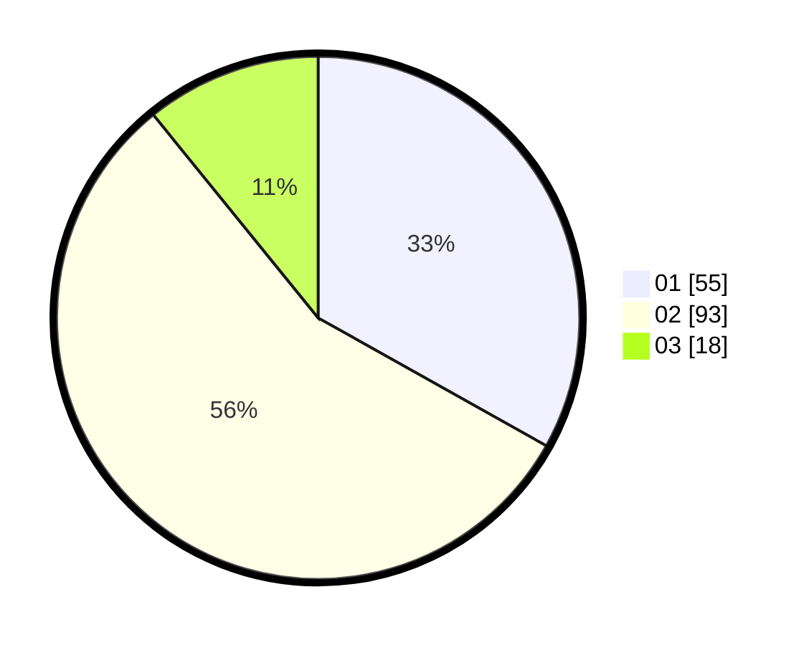

# Hasil

Hasil perolehan suara paslon dapat dilihat pada file paslon-01.txt, paslon-02.txt, dan paslon-03.txt.

Jika tidak ada, artinya data tersebut belum ada pada SIREKAP.

## Perolehan Suara

 * Paslon 01: **55**.
 * Paslon 02: **93**.
 * Paslon 03: **18**.

## Foto C Plano

https://sirekap-obj-formc.kpu.go.id/86e1/pemilu/ppwp/31/72/01/10/04/3172011004224-20240214-215255--f73fa5d5-b490-4e48-9242-fcf69b03673d.jpg

https://sirekap-obj-formc.kpu.go.id/86e1/pemilu/ppwp/31/72/01/10/04/3172011004224-20240214-215502--b674e8fb-9718-417c-9195-d1f9529c7526.jpg

https://sirekap-obj-formc.kpu.go.id/86e1/pemilu/ppwp/31/72/01/10/04/3172011004224-20240214-222923--1bc96b16-ac58-4ec1-901b-7d4dea7e4b11.jpg

## DATA PEMILIH TETAP

Jumlah pemilih dalam DPT: **251**.
 * L: **130**.
 * P: **121**.

## DATA PENGGUNA HAK PILIH

Jumlah pengguna hak pilih dalam DPT: **164**.
 * L: **80**.
 * P: **84**.

Jumlah pengguna hak pilih dalam DPTb: **1**.
 * L: **0**.
 * P: **1**.

Jumlah pengguna hak pilih dalam DPK: **2**.
 * L: **2**.
 * P: **0**.

Jumlah pengguna hak pilih: **167**.
 * L: **82**.
 * P: **85**.

## JUMLAH SUARA SAH DAN TIDAK SAH

JUMLAH SELURUH SUARA SAH: **166**.

JUMLAH SUARA TIDAK SAH: **1**.

JUMLAH SELURUH SUARA SAH DAN SUARA TIDAK SAH: **167**.
