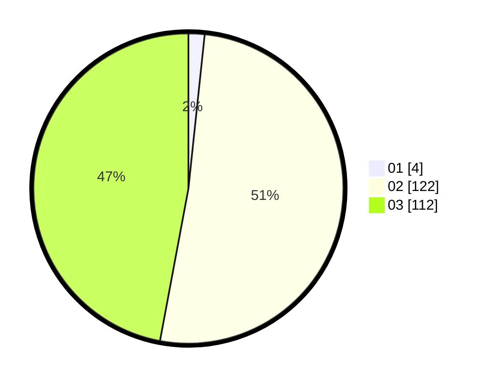

# Hasil

Hasil perolehan suara paslon dapat dilihat pada file paslon-01.txt, paslon-02.txt, dan paslon-03.txt.

Jika tidak ada, artinya data tersebut belum ada pada SIREKAP.

## Perolehan Suara

 * Paslon 01: **4**.
 * Paslon 02: **122**.
 * Paslon 03: **112**.

## Foto C Plano

https://sirekap-obj-formc.kpu.go.id/68aa/pemilu/ppwp/31/72/01/10/04/3172011004243-20240214-203306--994bd639-ec9c-4653-8970-44a07a6f734e.jpg

https://sirekap-obj-formc.kpu.go.id/68aa/pemilu/ppwp/31/72/01/10/04/3172011004243-20240214-203348--a7743c20-b4b8-4f79-8e1d-bb6a338e1266.jpg

https://sirekap-obj-formc.kpu.go.id/68aa/pemilu/ppwp/31/72/01/10/04/3172011004243-20240214-203425--bccaf377-f8f4-4e36-8fa0-20e03a464e2f.jpg

## DATA PEMILIH TETAP

Jumlah pemilih dalam DPT: **300**.
 * L: **135**.
 * P: **165**.

## DATA PENGGUNA HAK PILIH

Jumlah pengguna hak pilih dalam DPT: **212**.
 * L: **98**.
 * P: **114**.

Jumlah pengguna hak pilih dalam DPTb: **23**.
 * L: **8**.
 * P: **15**.

Jumlah pengguna hak pilih dalam DPK: **5**.
 * L: **2**.
 * P: **3**.

Jumlah pengguna hak pilih: **240**.
 * L: **108**.
 * P: **132**.

## JUMLAH SUARA SAH DAN TIDAK SAH

JUMLAH SELURUH SUARA SAH: **238**.

JUMLAH SUARA TIDAK SAH: **2**.

JUMLAH SELURUH SUARA SAH DAN SUARA TIDAK SAH: **240**.
