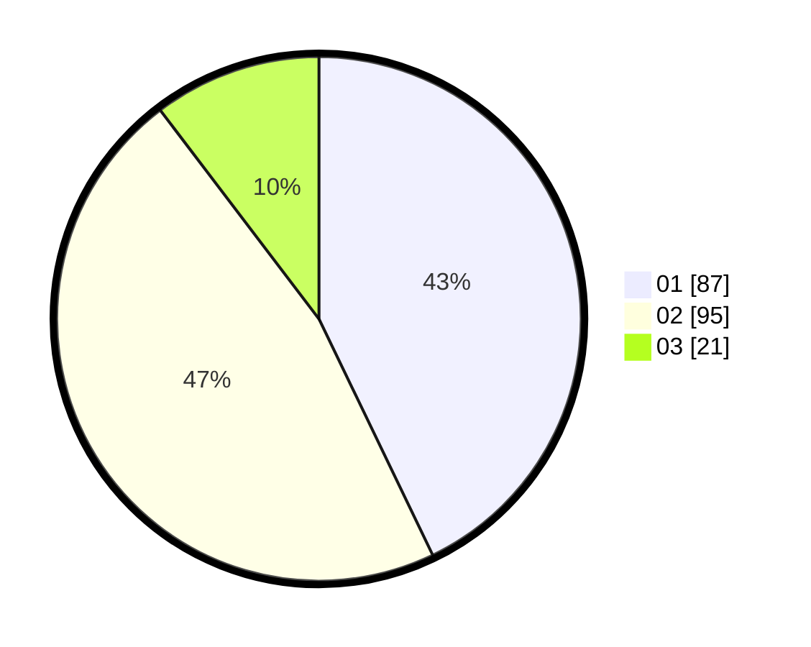

# Hasil

Hasil perolehan suara paslon dapat dilihat pada file paslon-01.txt, paslon-02.txt, dan paslon-03.txt.

Jika tidak ada, artinya data tersebut belum ada pada SIREKAP.

## Perolehan Suara

 * Paslon 01: **87**.
 * Paslon 02: **95**.
 * Paslon 03: **21**.

## Foto C Plano

https://sirekap-obj-formc.kpu.go.id/84fb/pemilu/ppwp/31/72/01/10/05/3172011005002-20240216-141443--a79cd19a-b5b0-4d4c-8cd7-1ea40e4acdfa.jpg

https://sirekap-obj-formc.kpu.go.id/84fb/pemilu/ppwp/31/72/01/10/05/3172011005002-20240216-141537--1b1308ff-66dd-4713-a315-d4c29b0e3273.jpg

https://sirekap-obj-formc.kpu.go.id/84fb/pemilu/ppwp/31/72/01/10/05/3172011005002-20240216-141610--8657d2c5-22d8-4fd6-8304-6bec36b15fee.jpg

## DATA PEMILIH TETAP

Jumlah pemilih dalam DPT: **287**.
 * L: **148**.
 * P: **139**.

## DATA PENGGUNA HAK PILIH

Jumlah pengguna hak pilih dalam DPT: **196**.
 * L: **94**.
 * P: **102**.

Jumlah pengguna hak pilih dalam DPTb: **7**.
 * L: **1**.
 * P: **6**.

Jumlah pengguna hak pilih dalam DPK: **0**.
 * L: **0**.
 * P: **0**.

Jumlah pengguna hak pilih: **203**.
 * L: **95**.
 * P: **108**.

## JUMLAH SUARA SAH DAN TIDAK SAH

JUMLAH SELURUH SUARA SAH: **203**.

JUMLAH SUARA TIDAK SAH: **0**.

JUMLAH SELURUH SUARA SAH DAN SUARA TIDAK SAH: **203**.
