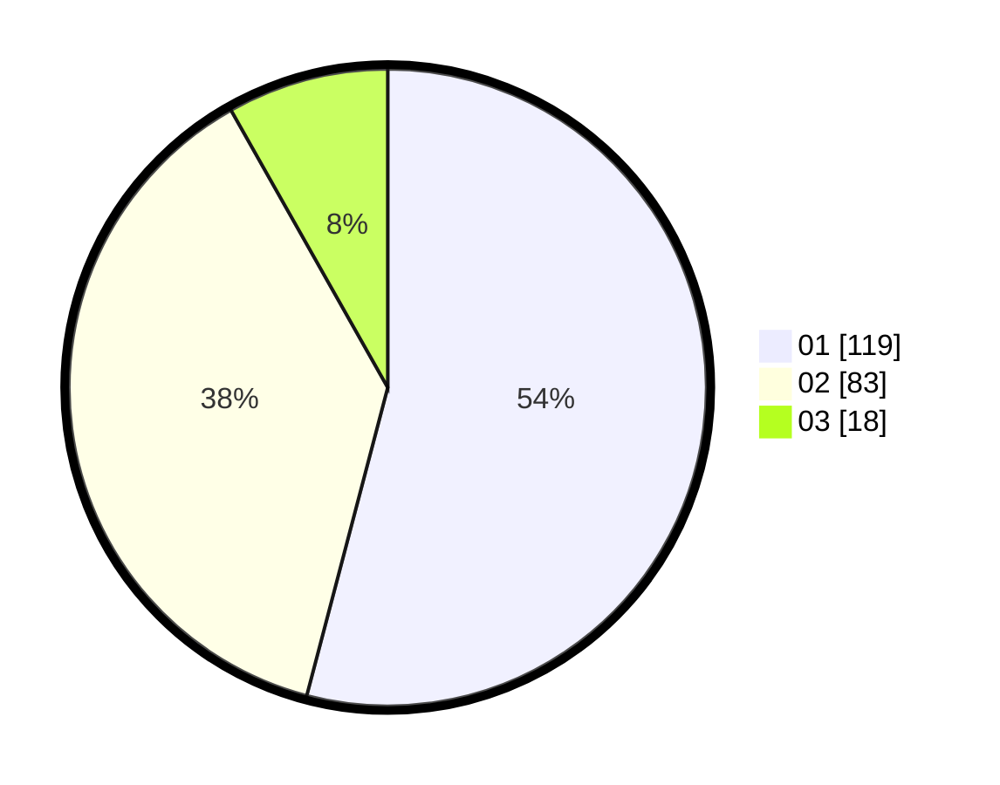

# Hasil

Hasil perolehan suara paslon dapat dilihat pada file paslon-01.txt, paslon-02.txt, dan paslon-03.txt.

Jika tidak ada, artinya data tersebut belum ada pada SIREKAP.

## Perolehan Suara

 * Paslon 01: **119**.
 * Paslon 02: **83**.
 * Paslon 03: **18**.

## Foto C Plano

https://sirekap-obj-formc.kpu.go.id/3202/pemilu/ppwp/31/72/01/10/05/3172011005003-20240216-142749--41166afb-d2a0-4e23-885d-e5d0668f4afc.jpg

https://sirekap-obj-formc.kpu.go.id/3202/pemilu/ppwp/31/72/01/10/05/3172011005003-20240216-143227--4bee3f2c-ac6a-4062-bdb1-9d488ad7ca39.jpg

https://sirekap-obj-formc.kpu.go.id/3202/pemilu/ppwp/31/72/01/10/05/3172011005003-20240216-142937--da4c5997-1f20-4876-a8ac-8ef560335e87.jpg

## DATA PEMILIH TETAP

Jumlah pemilih dalam DPT: **293**.
 * L: **142**.
 * P: **151**.

## DATA PENGGUNA HAK PILIH

Jumlah pengguna hak pilih dalam DPT: **220**.
 * L: **102**.
 * P: **118**.

Jumlah pengguna hak pilih dalam DPTb: **5**.
 * L: **3**.
 * P: **2**.

Jumlah pengguna hak pilih dalam DPK: **0**.
 * L: **0**.
 * P: **0**.

Jumlah pengguna hak pilih: **225**.
 * L: **105**.
 * P: **120**.

## JUMLAH SUARA SAH DAN TIDAK SAH

JUMLAH SELURUH SUARA SAH: **220**.

JUMLAH SUARA TIDAK SAH: **5**.

JUMLAH SELURUH SUARA SAH DAN SUARA TIDAK SAH: **225**.
