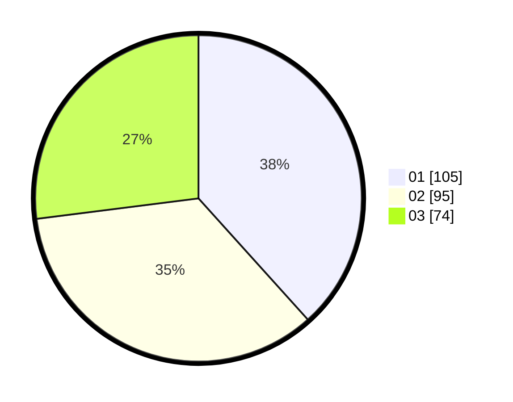

# Hasil

Hasil perolehan suara paslon dapat dilihat pada file paslon-01.txt, paslon-02.txt, dan paslon-03.txt.

Jika tidak ada, artinya data tersebut belum ada pada SIREKAP.

## Perolehan Suara

 * Paslon 01: **105**.
 * Paslon 02: **95**.
 * Paslon 03: **74**.

## Foto C Plano

https://sirekap-obj-formc.kpu.go.id/e55f/pemilu/ppwp/31/72/01/10/05/3172011005004-20240216-143819--3211e512-bbad-45ee-928a-222d2c4f197f.jpg

https://sirekap-obj-formc.kpu.go.id/e55f/pemilu/ppwp/31/72/01/10/05/3172011005004-20240216-143952--b5c60b4a-8e8f-4f37-b960-256bc997ffcb.jpg

https://sirekap-obj-formc.kpu.go.id/e55f/pemilu/ppwp/31/72/01/10/05/3172011005004-20240216-144100--f2684080-70e1-4bba-bfd5-20e2ab9c4048.jpg

## DATA PEMILIH TETAP

Jumlah pemilih dalam DPT: **283**.
 * L: **143**.
 * P: **140**.

## DATA PENGGUNA HAK PILIH

Jumlah pengguna hak pilih dalam DPT: **213**.
 * L: **107**.
 * P: **106**.

Jumlah pengguna hak pilih dalam DPTb: **2**.
 * L: **1**.
 * P: **1**.

Jumlah pengguna hak pilih dalam DPK: **10**.
 * L: **4**.
 * P: **6**.

Jumlah pengguna hak pilih: **225**.
 * L: **112**.
 * P: **113**.

## JUMLAH SUARA SAH DAN TIDAK SAH

JUMLAH SELURUH SUARA SAH: **223**.

JUMLAH SUARA TIDAK SAH: **2**.

JUMLAH SELURUH SUARA SAH DAN SUARA TIDAK SAH: **225**.
