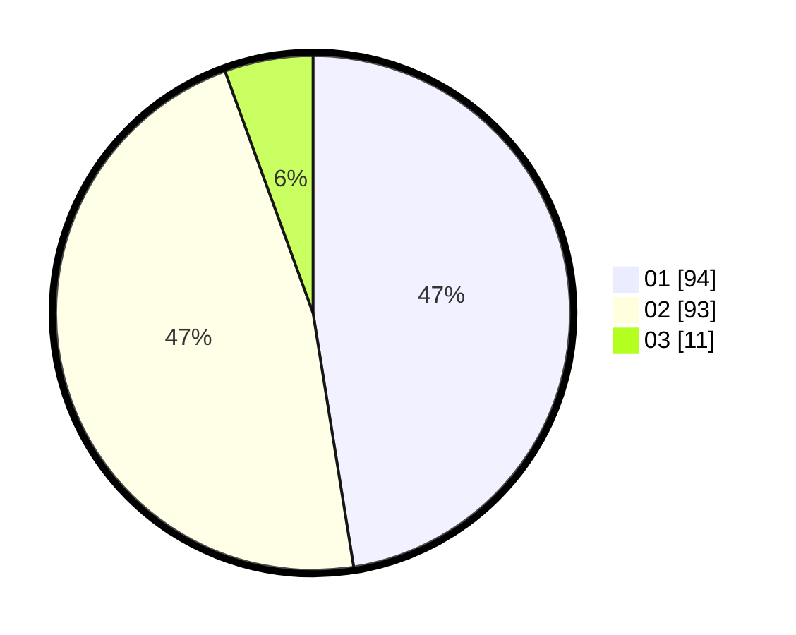

# Hasil

Hasil perolehan suara paslon dapat dilihat pada file paslon-01.txt, paslon-02.txt, dan paslon-03.txt.

Jika tidak ada, artinya data tersebut belum ada pada SIREKAP.

## Perolehan Suara

 * Paslon 01: **94**.
 * Paslon 02: **93**.
 * Paslon 03: **11**.

## Foto C Plano

https://sirekap-obj-formc.kpu.go.id/f32c/pemilu/ppwp/31/72/01/10/05/3172011005008-20240216-163956--14f923e8-ff66-46be-a641-db093419ca73.jpg

https://sirekap-obj-formc.kpu.go.id/f32c/pemilu/ppwp/31/72/01/10/05/3172011005008-20240216-164027--0b5d9472-92d8-40bb-8222-3ee058b540ae.jpg

https://sirekap-obj-formc.kpu.go.id/f32c/pemilu/ppwp/31/72/01/10/05/3172011005008-20240216-164228--bbdfc69c-6d92-4682-aea9-68aa25a2ef97.jpg

## DATA PEMILIH TETAP

Jumlah pemilih dalam DPT: **300**.
 * L: **154**.
 * P: **146**.

## DATA PENGGUNA HAK PILIH

Jumlah pengguna hak pilih dalam DPT: **201**.
 * L: **98**.
 * P: **103**.

Jumlah pengguna hak pilih dalam DPTb: **0**.
 * L: **0**.
 * P: **0**.

Jumlah pengguna hak pilih dalam DPK: **1**.
 * L: **0**.
 * P: **1**.

Jumlah pengguna hak pilih: **202**.
 * L: **98**.
 * P: **104**.

## JUMLAH SUARA SAH DAN TIDAK SAH

JUMLAH SELURUH SUARA SAH: **198**.

JUMLAH SUARA TIDAK SAH: **4**.

JUMLAH SELURUH SUARA SAH DAN SUARA TIDAK SAH: **202**.
