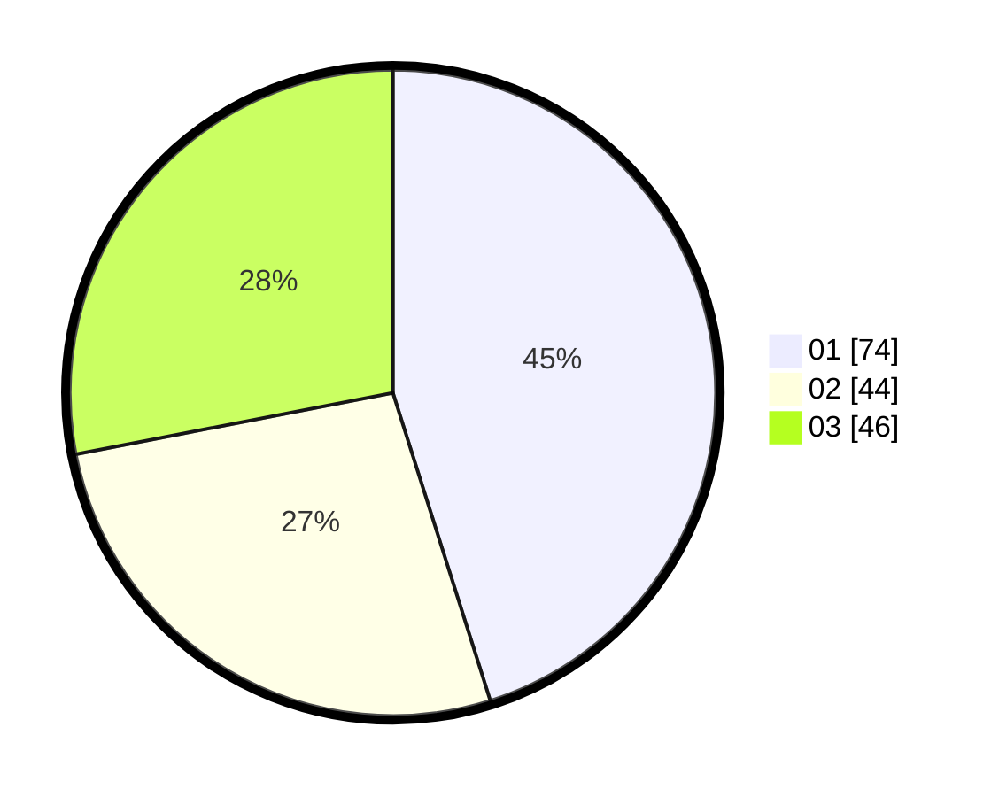

# Hasil

Hasil perolehan suara paslon dapat dilihat pada file paslon-01.txt, paslon-02.txt, dan paslon-03.txt.

Jika tidak ada, artinya data tersebut belum ada pada SIREKAP.

## Perolehan Suara

 * Paslon 01: **74**.
 * Paslon 02: **44**.
 * Paslon 03: **46**.

## Foto C Plano

https://sirekap-obj-formc.kpu.go.id/14e6/pemilu/ppwp/31/72/01/10/05/3172011005009-20240216-165122--55ee8c31-b6f1-44e5-bed8-a91425ff6cc6.jpg

https://sirekap-obj-formc.kpu.go.id/14e6/pemilu/ppwp/31/72/01/10/05/3172011005009-20240216-165207--9ad952c2-3043-488e-96d5-ddd6f4a134d8.jpg

https://sirekap-obj-formc.kpu.go.id/14e6/pemilu/ppwp/31/72/01/10/05/3172011005009-20240216-165330--6a9678e0-dd9c-4a4e-a5a3-8f0926f11b4c.jpg

## DATA PEMILIH TETAP

Jumlah pemilih dalam DPT: **292**.
 * L: **149**.
 * P: **143**.

## DATA PENGGUNA HAK PILIH

Jumlah pengguna hak pilih dalam DPT: **194**.
 * L: **102**.
 * P: **92**.

Jumlah pengguna hak pilih dalam DPTb: **0**.
 * L: **0**.
 * P: **0**.

Jumlah pengguna hak pilih dalam DPK: **0**.
 * L: **0**.
 * P: **0**.

Jumlah pengguna hak pilih: **194**.
 * L: **102**.
 * P: **92**.

## JUMLAH SUARA SAH DAN TIDAK SAH

JUMLAH SELURUH SUARA SAH: **188**.

JUMLAH SUARA TIDAK SAH: **6**.

JUMLAH SELURUH SUARA SAH DAN SUARA TIDAK SAH: **194**.
