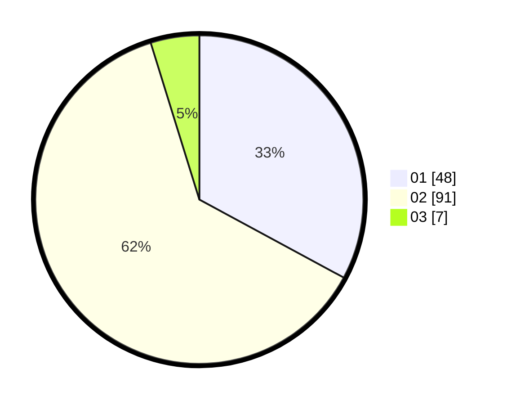

# Hasil

Hasil perolehan suara paslon dapat dilihat pada file paslon-01.txt, paslon-02.txt, dan paslon-03.txt.

Jika tidak ada, artinya data tersebut belum ada pada SIREKAP.

## Perolehan Suara

 * Paslon 01: **48**.
 * Paslon 02: **91**.
 * Paslon 03: **7**.

## Foto C Plano

https://sirekap-obj-formc.kpu.go.id/5888/pemilu/ppwp/31/72/01/10/05/3172011005013-20240214-221844--201b1740-b52d-4cf6-bf3a-1e2485995f4a.jpg

https://sirekap-obj-formc.kpu.go.id/5888/pemilu/ppwp/31/72/01/10/05/3172011005013-20240214-222012--e2b7d481-022b-4ca4-8543-920bb450d080.jpg

https://sirekap-obj-formc.kpu.go.id/5888/pemilu/ppwp/31/72/01/10/05/3172011005013-20240214-222116--819aed30-22d1-4eb6-ae11-ab0f9b45d034.jpg

## DATA PEMILIH TETAP

Jumlah pemilih dalam DPT: **245**.
 * L: **173**.
 * P: **112**.

## DATA PENGGUNA HAK PILIH

Jumlah pengguna hak pilih dalam DPT: **147**.
 * L: **72**.
 * P: **75**.

Jumlah pengguna hak pilih dalam DPTb: **0**.
 * L: **0**.
 * P: **0**.

Jumlah pengguna hak pilih dalam DPK: **0**.
 * L: **0**.
 * P: **0**.

Jumlah pengguna hak pilih: **147**.
 * L: **72**.
 * P: **75**.

## JUMLAH SUARA SAH DAN TIDAK SAH

JUMLAH SELURUH SUARA SAH: **146**.

JUMLAH SUARA TIDAK SAH: **1**.

JUMLAH SELURUH SUARA SAH DAN SUARA TIDAK SAH: **147**.
