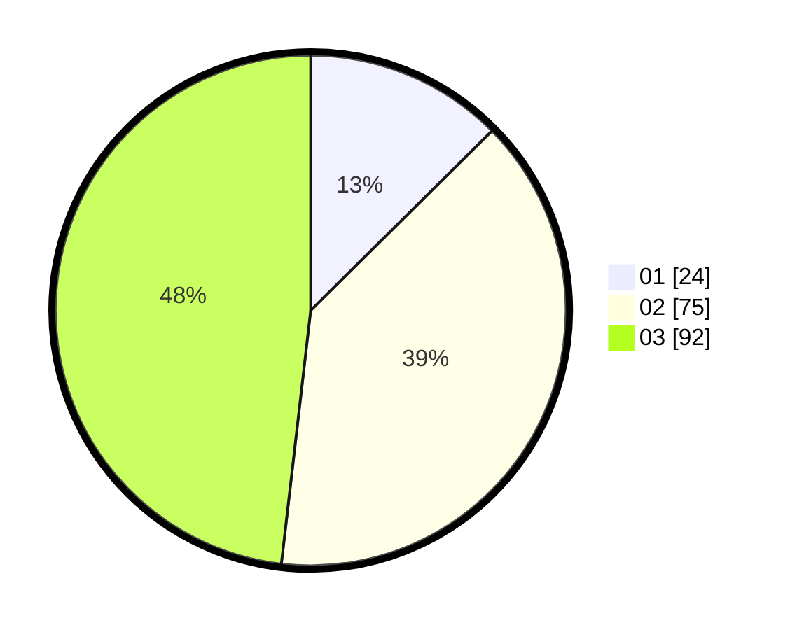

# Hasil

Hasil perolehan suara paslon dapat dilihat pada file paslon-01.txt, paslon-02.txt, dan paslon-03.txt.

Jika tidak ada, artinya data tersebut belum ada pada SIREKAP.

## Perolehan Suara

 * Paslon 01: **24**.
 * Paslon 02: **75**.
 * Paslon 03: **92**.

## Foto C Plano

https://sirekap-obj-formc.kpu.go.id/4bf8/pemilu/ppwp/31/72/01/10/05/3172011005023-20240214-221811--41cd482c-e18a-485f-803f-3d804227381d.jpg

https://sirekap-obj-formc.kpu.go.id/4bf8/pemilu/ppwp/31/72/01/10/05/3172011005023-20240214-201619--8378fd11-e253-44c6-b914-061669846062.jpg

https://sirekap-obj-formc.kpu.go.id/4bf8/pemilu/ppwp/31/72/01/10/05/3172011005023-20240214-202023--07eda1b0-429f-4126-ba2f-538ea8c49f7c.jpg
