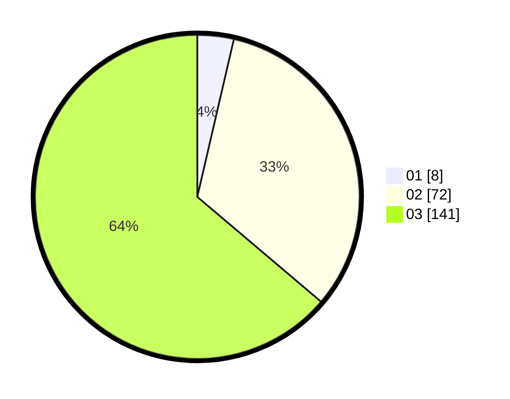

# Hasil

Hasil perolehan suara paslon dapat dilihat pada file paslon-01.txt, paslon-02.txt, dan paslon-03.txt.

Jika tidak ada, artinya data tersebut belum ada pada SIREKAP.

## Perolehan Suara

 * Paslon 01: **8**.
 * Paslon 02: **72**.
 * Paslon 03: **141**.

## Foto C Plano

https://sirekap-obj-formc.kpu.go.id/786c/pemilu/ppwp/31/72/01/10/05/3172011005044-20240217-111614--bf61349e-a97b-48aa-a069-ac0a15483ec6.jpg

https://sirekap-obj-formc.kpu.go.id/786c/pemilu/ppwp/31/72/01/10/05/3172011005044-20240217-111745--ca022145-c61b-474c-91c7-d4724f708724.jpg

https://sirekap-obj-formc.kpu.go.id/786c/pemilu/ppwp/31/72/01/10/05/3172011005044-20240217-111812--6b72d5d9-5596-4c35-961c-acf62aaa59e2.jpg

## DATA PEMILIH TETAP

Jumlah pemilih dalam DPT: **284**.
 * L: **127**.
 * P: **157**.

## DATA PENGGUNA HAK PILIH

Jumlah pengguna hak pilih dalam DPT: **210**.
 * L: **95**.
 * P: **115**.

Jumlah pengguna hak pilih dalam DPTb: **12**.
 * L: **2**.
 * P: **10**.

Jumlah pengguna hak pilih dalam DPK: **2**.
 * L: **1**.
 * P: **1**.

Jumlah pengguna hak pilih: **224**.
 * L: **98**.
 * P: **126**.

## JUMLAH SUARA SAH DAN TIDAK SAH

JUMLAH SELURUH SUARA SAH: **221**.

JUMLAH SUARA TIDAK SAH: **3**.

JUMLAH SELURUH SUARA SAH DAN SUARA TIDAK SAH: **224**.
