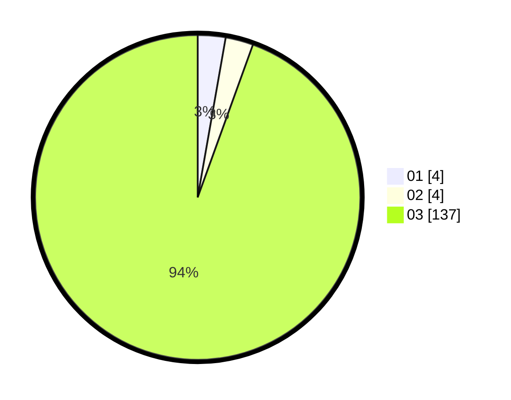

# Hasil

Hasil perolehan suara paslon dapat dilihat pada file paslon-01.txt, paslon-02.txt, dan paslon-03.txt.

Jika tidak ada, artinya data tersebut belum ada pada SIREKAP.

## Perolehan Suara

 * Paslon 01: **4**.
 * Paslon 02: **4**.
 * Paslon 03: **137**.

## Foto C Plano

https://sirekap-obj-formc.kpu.go.id/accf/pemilu/ppwp/31/72/01/10/05/3172011005045-20240217-140503--4a237f1c-cf64-4f2e-a614-8ec00d70555c.jpg

https://sirekap-obj-formc.kpu.go.id/accf/pemilu/ppwp/31/72/01/10/05/3172011005045-20240217-140533--5d54e6c6-eb30-4e82-93c2-d7d1618e299b.jpg

https://sirekap-obj-formc.kpu.go.id/accf/pemilu/ppwp/31/72/01/10/05/3172011005045-20240217-140613--c68801f9-3eca-4939-a4be-4e6002bc3164.jpg

## DATA PEMILIH TETAP

Jumlah pemilih dalam DPT: **289**.
 * L: **138**.
 * P: **151**.

## DATA PENGGUNA HAK PILIH

Jumlah pengguna hak pilih dalam DPT: **205**.
 * L: **100**.
 * P: **105**.

Jumlah pengguna hak pilih dalam DPTb: **19**.
 * L: **3**.
 * P: **16**.

Jumlah pengguna hak pilih dalam DPK: **9**.
 * L: **4**.
 * P: **5**.

Jumlah pengguna hak pilih: **233**.
 * L: **107**.
 * P: **126**.

## JUMLAH SUARA SAH DAN TIDAK SAH

JUMLAH SELURUH SUARA SAH: **233**.

JUMLAH SUARA TIDAK SAH: **0**.

JUMLAH SELURUH SUARA SAH DAN SUARA TIDAK SAH: **233**.
