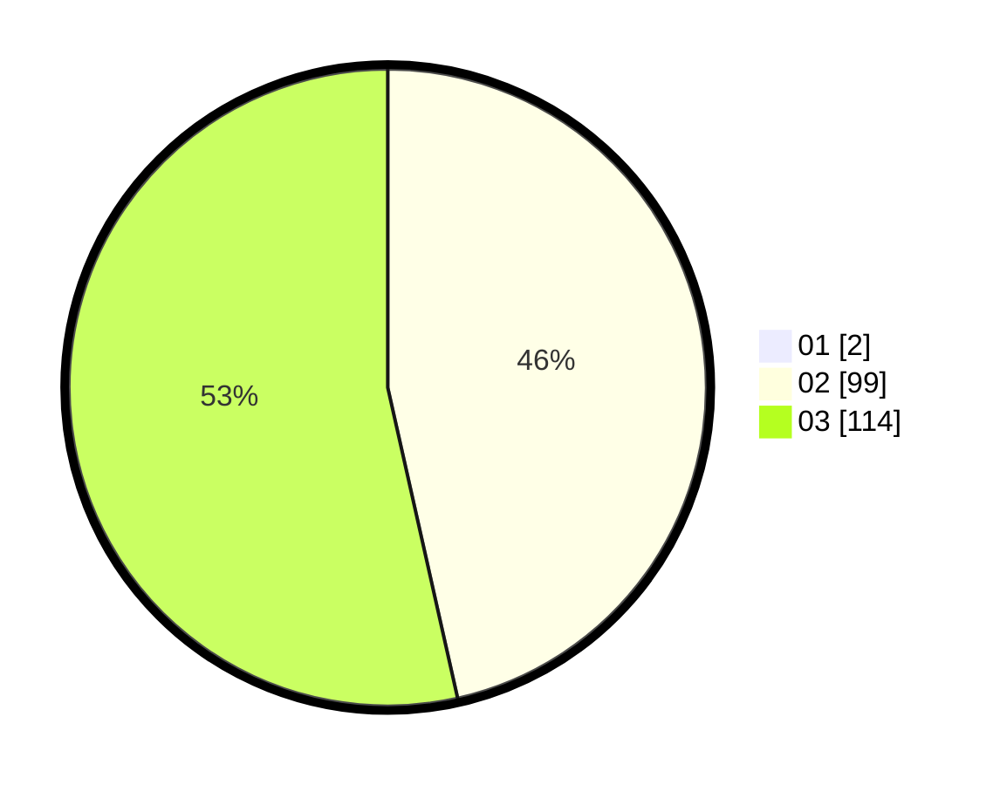

# Hasil

Hasil perolehan suara paslon dapat dilihat pada file paslon-01.txt, paslon-02.txt, dan paslon-03.txt.

Jika tidak ada, artinya data tersebut belum ada pada SIREKAP.

## Perolehan Suara

 * Paslon 01: **2**.
 * Paslon 02: **99**.
 * Paslon 03: **114**.

## Foto C Plano

https://sirekap-obj-formc.kpu.go.id/5bf4/pemilu/ppwp/31/72/01/10/05/3172011005046-20240217-112640--cf031683-23c9-477a-8ef4-f686be9ecc52.jpg

https://sirekap-obj-formc.kpu.go.id/5bf4/pemilu/ppwp/31/72/01/10/05/3172011005046-20240217-112812--147a7ca6-7c8f-4281-9757-b9a1fde00743.jpg

https://sirekap-obj-formc.kpu.go.id/5bf4/pemilu/ppwp/31/72/01/10/05/3172011005046-20240217-112959--8246a627-0bc0-4352-8549-5520c529fa9b.jpg

## DATA PEMILIH TETAP

Jumlah pemilih dalam DPT: **297**.
 * L: **137**.
 * P: **160**.

## DATA PENGGUNA HAK PILIH

Jumlah pengguna hak pilih dalam DPT: **201**.
 * L: **94**.
 * P: **107**.

Jumlah pengguna hak pilih dalam DPTb: **13**.
 * L: **5**.
 * P: **8**.

Jumlah pengguna hak pilih dalam DPK: **1**.
 * L: **0**.
 * P: **1**.

Jumlah pengguna hak pilih: **215**.
 * L: **99**.
 * P: **116**.

## JUMLAH SUARA SAH DAN TIDAK SAH

JUMLAH SELURUH SUARA SAH: **215**.

JUMLAH SUARA TIDAK SAH: **0**.

JUMLAH SELURUH SUARA SAH DAN SUARA TIDAK SAH: **215**.
