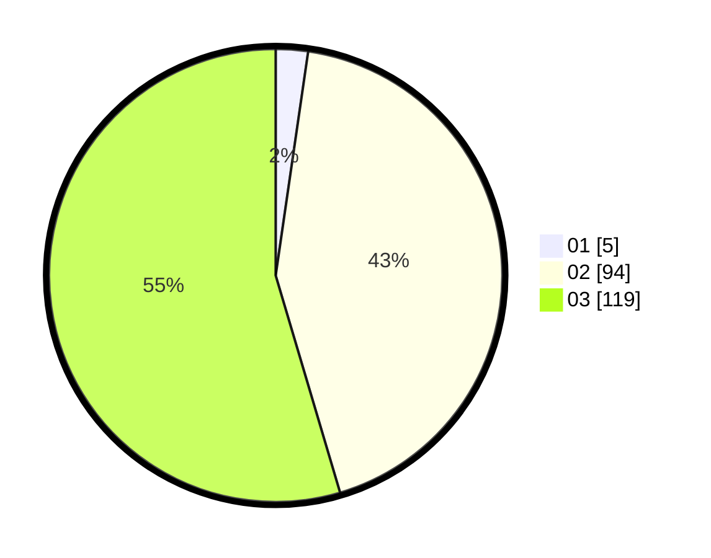

# Hasil

Hasil perolehan suara paslon dapat dilihat pada file paslon-01.txt, paslon-02.txt, dan paslon-03.txt.

Jika tidak ada, artinya data tersebut belum ada pada SIREKAP.

## Perolehan Suara

 * Paslon 01: **5**.
 * Paslon 02: **94**.
 * Paslon 03: **119**.

## Foto C Plano

https://sirekap-obj-formc.kpu.go.id/8ff6/pemilu/ppwp/31/72/01/10/05/3172011005047-20240217-113259--00bbca7f-ef20-4f47-ace5-7eab15c625d9.jpg

https://sirekap-obj-formc.kpu.go.id/8ff6/pemilu/ppwp/31/72/01/10/05/3172011005047-20240217-113331--8ebe86b7-0367-483d-9be1-ac5e8a620fa1.jpg

https://sirekap-obj-formc.kpu.go.id/8ff6/pemilu/ppwp/31/72/01/10/05/3172011005047-20240217-113404--3dc0cbd2-b999-48c5-9c30-b453716ff3ea.jpg

## DATA PEMILIH TETAP

Jumlah pemilih dalam DPT: **289**.
 * L: **132**.
 * P: **157**.

## DATA PENGGUNA HAK PILIH

Jumlah pengguna hak pilih dalam DPT: **193**.
 * L: **86**.
 * P: **107**.

Jumlah pengguna hak pilih dalam DPTb: **11**.
 * L: **4**.
 * P: **7**.

Jumlah pengguna hak pilih dalam DPK: **16**.
 * L: **8**.
 * P: **8**.

Jumlah pengguna hak pilih: **220**.
 * L: **98**.
 * P: **122**.

## JUMLAH SUARA SAH DAN TIDAK SAH

JUMLAH SELURUH SUARA SAH: **218**.

JUMLAH SUARA TIDAK SAH: **2**.

JUMLAH SELURUH SUARA SAH DAN SUARA TIDAK SAH: **220**.
