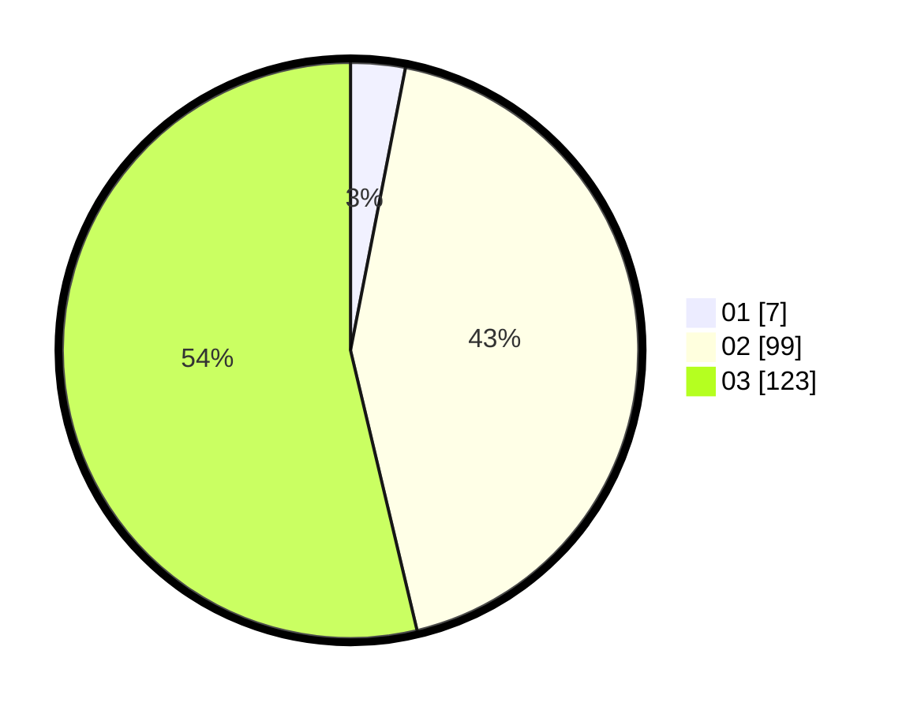

# Hasil

Hasil perolehan suara paslon dapat dilihat pada file paslon-01.txt, paslon-02.txt, dan paslon-03.txt.

Jika tidak ada, artinya data tersebut belum ada pada SIREKAP.

## Perolehan Suara

 * Paslon 01: **7**.
 * Paslon 02: **99**.
 * Paslon 03: **123**.

## Foto C Plano

https://sirekap-obj-formc.kpu.go.id/67ad/pemilu/ppwp/31/72/01/10/05/3172011005049-20240217-115609--527dc86a-e600-45c5-835c-499a80e87149.jpg

https://sirekap-obj-formc.kpu.go.id/67ad/pemilu/ppwp/31/72/01/10/05/3172011005049-20240217-115640--54f4401b-42e9-4970-8290-2acf5dbff402.jpg

https://sirekap-obj-formc.kpu.go.id/67ad/pemilu/ppwp/31/72/01/10/05/3172011005049-20240217-115707--2b304c13-11e7-4a92-94e1-891f82aebc35.jpg

## DATA PEMILIH TETAP

Jumlah pemilih dalam DPT: **292**.
 * L: **136**.
 * P: **156**.

## DATA PENGGUNA HAK PILIH

Jumlah pengguna hak pilih dalam DPT: **198**.
 * L: **89**.
 * P: **109**.

Jumlah pengguna hak pilih dalam DPTb: **16**.
 * L: **4**.
 * P: **12**.

Jumlah pengguna hak pilih dalam DPK: **16**.
 * L: **8**.
 * P: **8**.

Jumlah pengguna hak pilih: **230**.
 * L: **101**.
 * P: **129**.

## JUMLAH SUARA SAH DAN TIDAK SAH

JUMLAH SELURUH SUARA SAH: **225**.

JUMLAH SUARA TIDAK SAH: **5**.

JUMLAH SELURUH SUARA SAH DAN SUARA TIDAK SAH: **230**.
