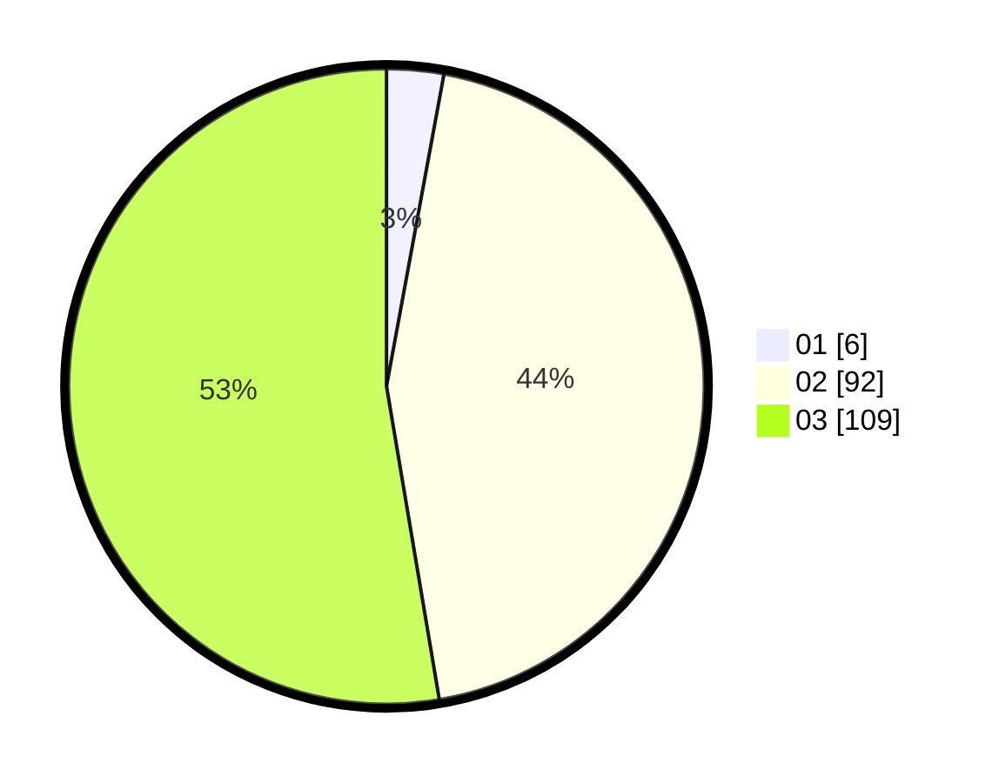

# Hasil

Hasil perolehan suara paslon dapat dilihat pada file paslon-01.txt, paslon-02.txt, dan paslon-03.txt.

Jika tidak ada, artinya data tersebut belum ada pada SIREKAP.

## Perolehan Suara

 * Paslon 01: **6**.
 * Paslon 02: **92**.
 * Paslon 03: **109**.

## Foto C Plano

https://sirekap-obj-formc.kpu.go.id/6db6/pemilu/ppwp/31/72/01/10/05/3172011005050-20240217-141055--dfb7cf5e-12d8-4f81-be4a-668f2a98e288.jpg

https://sirekap-obj-formc.kpu.go.id/6db6/pemilu/ppwp/31/72/01/10/05/3172011005050-20240217-141129--3cd59ca6-1467-46aa-aeb7-386c3dac4d62.jpg

https://sirekap-obj-formc.kpu.go.id/6db6/pemilu/ppwp/31/72/01/10/05/3172011005050-20240217-141204--7ec0f306-8605-403b-92af-b5da72de4800.jpg

## DATA PEMILIH TETAP

Jumlah pemilih dalam DPT: **276**.
 * L: **124**.
 * P: **152**.

## DATA PENGGUNA HAK PILIH

Jumlah pengguna hak pilih dalam DPT: **182**.
 * L: **82**.
 * P: **100**.

Jumlah pengguna hak pilih dalam DPTb: **18**.
 * L: **10**.
 * P: **8**.

Jumlah pengguna hak pilih dalam DPK: **7**.
 * L: **3**.
 * P: **4**.

Jumlah pengguna hak pilih: **207**.
 * L: **95**.
 * P: **112**.

## JUMLAH SUARA SAH DAN TIDAK SAH

JUMLAH SELURUH SUARA SAH: **207**.

JUMLAH SUARA TIDAK SAH: **0**.

JUMLAH SELURUH SUARA SAH DAN SUARA TIDAK SAH: **207**.
