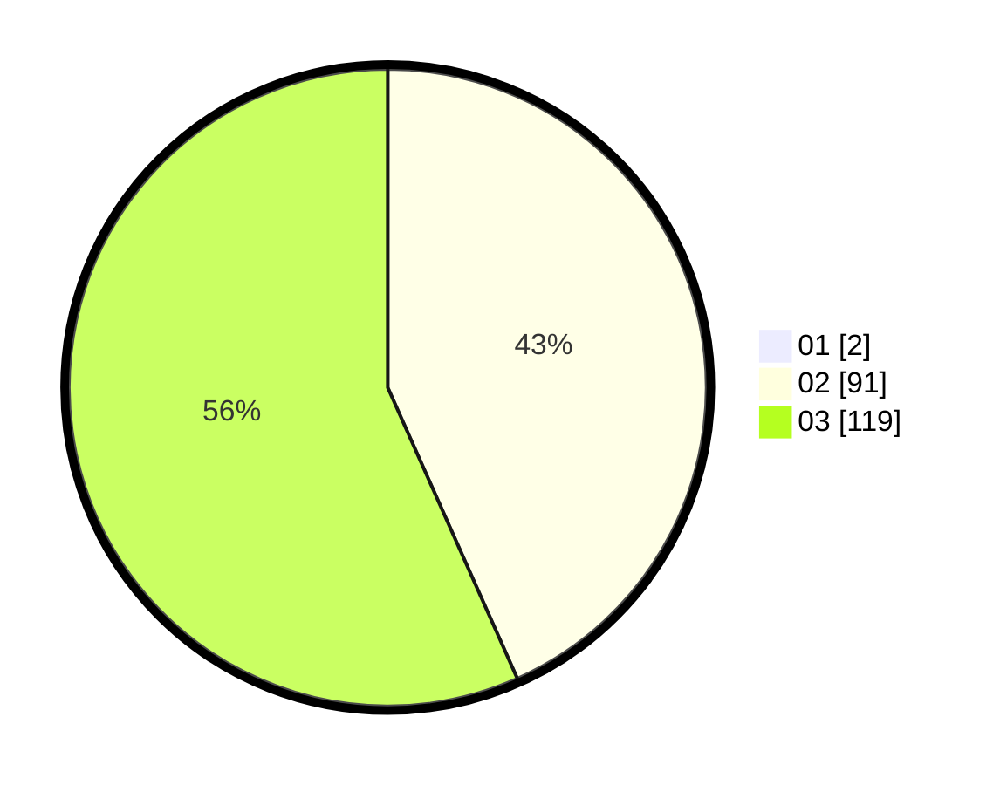

# Hasil

Hasil perolehan suara paslon dapat dilihat pada file paslon-01.txt, paslon-02.txt, dan paslon-03.txt.

Jika tidak ada, artinya data tersebut belum ada pada SIREKAP.

## Perolehan Suara

 * Paslon 01: **2**.
 * Paslon 02: **91**.
 * Paslon 03: **119**.

## Foto C Plano

https://sirekap-obj-formc.kpu.go.id/5696/pemilu/ppwp/31/72/01/10/05/3172011005052-20240217-142222--4bc56135-ef88-48ca-8029-b1014154fae3.jpg

https://sirekap-obj-formc.kpu.go.id/5696/pemilu/ppwp/31/72/01/10/05/3172011005052-20240217-142254--cefd646b-80ed-4252-945c-3e5ebafd93dd.jpg

https://sirekap-obj-formc.kpu.go.id/5696/pemilu/ppwp/31/72/01/10/05/3172011005052-20240217-142327--3a7322e2-7a53-46de-a0d1-9c0bd3fb2038.jpg

## DATA PEMILIH TETAP

Jumlah pemilih dalam DPT: **293**.
 * L: **144**.
 * P: **149**.

## DATA PENGGUNA HAK PILIH

Jumlah pengguna hak pilih dalam DPT: **194**.
 * L: **90**.
 * P: **104**.

Jumlah pengguna hak pilih dalam DPTb: **12**.
 * L: **6**.
 * P: **6**.

Jumlah pengguna hak pilih dalam DPK: **7**.
 * L: **3**.
 * P: **4**.

Jumlah pengguna hak pilih: **213**.
 * L: **99**.
 * P: **114**.

## JUMLAH SUARA SAH DAN TIDAK SAH

JUMLAH SELURUH SUARA SAH: **212**.

JUMLAH SUARA TIDAK SAH: **1**.

JUMLAH SELURUH SUARA SAH DAN SUARA TIDAK SAH: **213**.
