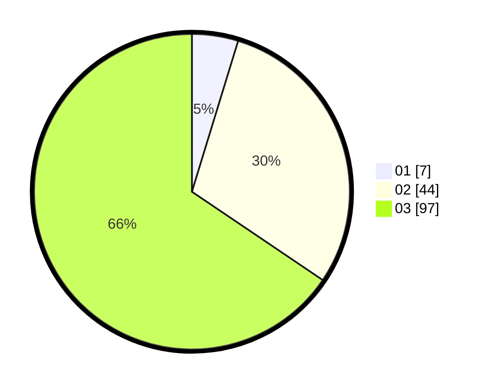

# Hasil

Hasil perolehan suara paslon dapat dilihat pada file paslon-01.txt, paslon-02.txt, dan paslon-03.txt.

Jika tidak ada, artinya data tersebut belum ada pada SIREKAP.

## Perolehan Suara

 * Paslon 01: **7**.
 * Paslon 02: **44**.
 * Paslon 03: **97**.

## Foto C Plano

https://sirekap-obj-formc.kpu.go.id/949e/pemilu/ppwp/31/72/01/10/05/3172011005053-20240217-142726--97c9b27f-b05a-4a45-8ddc-ccf8d02cbb6f.jpg

https://sirekap-obj-formc.kpu.go.id/949e/pemilu/ppwp/31/72/01/10/05/3172011005053-20240217-142755--5cc096c8-e2ba-4229-b948-964742d99a35.jpg

https://sirekap-obj-formc.kpu.go.id/949e/pemilu/ppwp/31/72/01/10/05/3172011005053-20240217-142829--0e5194da-5671-4323-912f-7a22fc7e1860.jpg

## DATA PEMILIH TETAP

Jumlah pemilih dalam DPT: **257**.
 * L: **119**.
 * P: **138**.

## DATA PENGGUNA HAK PILIH

Jumlah pengguna hak pilih dalam DPT: **153**.
 * L: **70**.
 * P: **83**.

Jumlah pengguna hak pilih dalam DPTb: **18**.
 * L: **10**.
 * P: **8**.

Jumlah pengguna hak pilih dalam DPK: **0**.
 * L: **0**.
 * P: **0**.

Jumlah pengguna hak pilih: **171**.
 * L: **80**.
 * P: **91**.

## JUMLAH SUARA SAH DAN TIDAK SAH

JUMLAH SELURUH SUARA SAH: **168**.

JUMLAH SUARA TIDAK SAH: **3**.

JUMLAH SELURUH SUARA SAH DAN SUARA TIDAK SAH: **171**.
