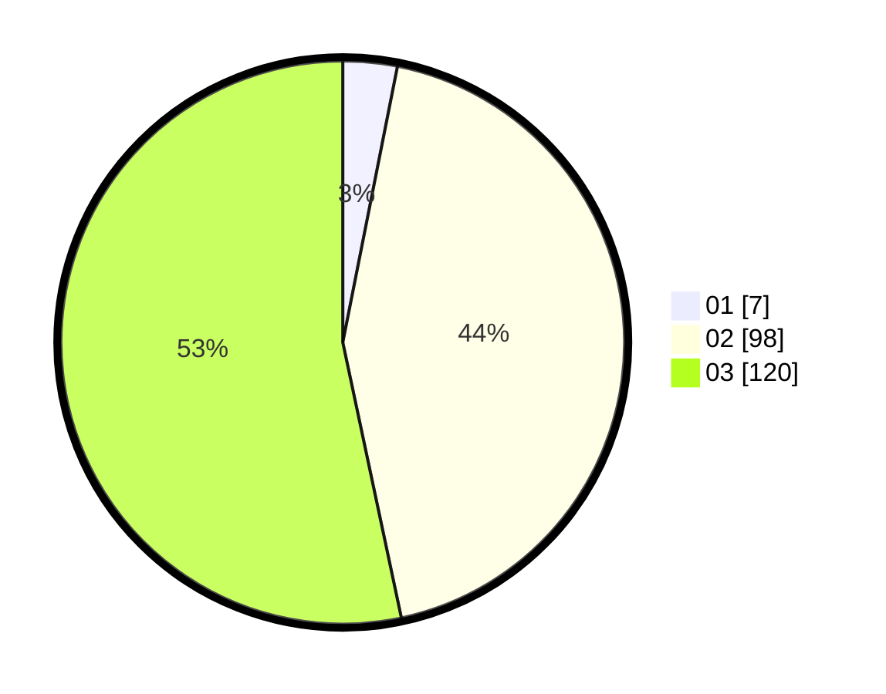

# Hasil

Hasil perolehan suara paslon dapat dilihat pada file paslon-01.txt, paslon-02.txt, dan paslon-03.txt.

Jika tidak ada, artinya data tersebut belum ada pada SIREKAP.

## Perolehan Suara

 * Paslon 01: **7**.
 * Paslon 02: **98**.
 * Paslon 03: **120**.

## Foto C Plano

https://sirekap-obj-formc.kpu.go.id/afae/pemilu/ppwp/31/72/01/10/05/3172011005127-20240214-203446--299e9c44-43f2-46e6-87b1-7077ecb14867.jpg

https://sirekap-obj-formc.kpu.go.id/afae/pemilu/ppwp/31/72/01/10/05/3172011005127-20240214-203415--4c046a09-af26-4a3c-b580-f5c1894ff890.jpg

https://sirekap-obj-formc.kpu.go.id/afae/pemilu/ppwp/31/72/01/10/05/3172011005127-20240214-203334--cf3907b4-dc30-482e-b69f-d038f8fa54f6.jpg

## DATA PEMILIH TETAP

Jumlah pemilih dalam DPT: **270**.
 * L: **125**.
 * P: **145**.

## DATA PENGGUNA HAK PILIH

Jumlah pengguna hak pilih dalam DPT: **214**.
 * L: **93**.
 * P: **121**.

Jumlah pengguna hak pilih dalam DPTb: **9**.
 * L: **2**.
 * P: **7**.

Jumlah pengguna hak pilih dalam DPK: **3**.
 * L: **1**.
 * P: **2**.

Jumlah pengguna hak pilih: **226**.
 * L: **96**.
 * P: **130**.

## JUMLAH SUARA SAH DAN TIDAK SAH

JUMLAH SELURUH SUARA SAH: **225**.

JUMLAH SUARA TIDAK SAH: **1**.

JUMLAH SELURUH SUARA SAH DAN SUARA TIDAK SAH: **226**.
