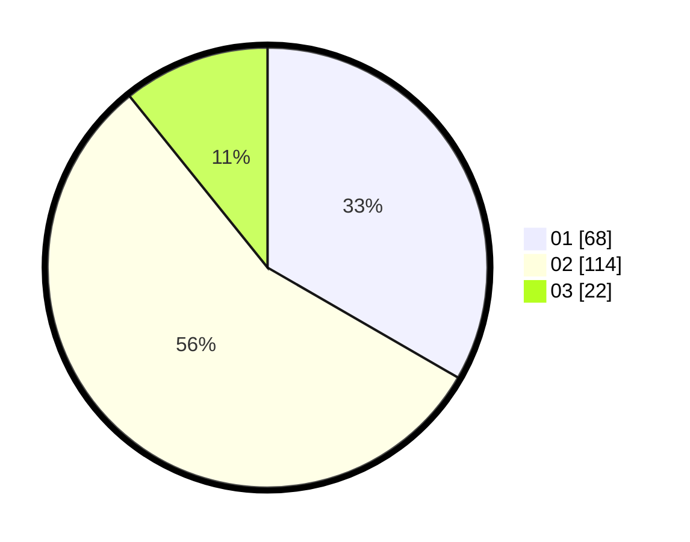

# Hasil

Hasil perolehan suara paslon dapat dilihat pada file paslon-01.txt, paslon-02.txt, dan paslon-03.txt.

Jika tidak ada, artinya data tersebut belum ada pada SIREKAP.

## Perolehan Suara

 * Paslon 01: **68**.
 * Paslon 02: **114**.
 * Paslon 03: **22**.

## Foto C Plano

https://sirekap-obj-formc.kpu.go.id/b599/pemilu/ppwp/31/72/01/10/05/3172011005145-20240216-210217--d1723fd5-5236-4991-bbd6-9d07819f9598.jpg

https://sirekap-obj-formc.kpu.go.id/b599/pemilu/ppwp/31/72/01/10/05/3172011005145-20240216-210235--3730332b-2bf9-41e8-999c-81619d1e3b60.jpg
