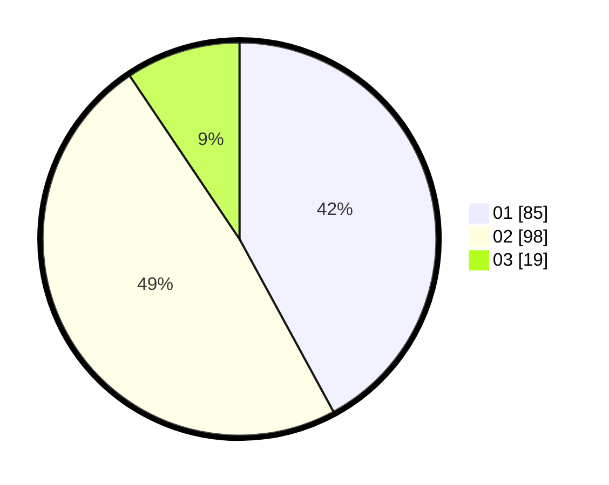

# Hasil

Hasil perolehan suara paslon dapat dilihat pada file paslon-01.txt, paslon-02.txt, dan paslon-03.txt.

Jika tidak ada, artinya data tersebut belum ada pada SIREKAP.

## Perolehan Suara

 * Paslon 01: **85**.
 * Paslon 02: **98**.
 * Paslon 03: **19**.

## Foto C Plano

https://sirekap-obj-formc.kpu.go.id/1aa3/pemilu/ppwp/31/72/02/10/01/3172021001004-20240214-234604--d498fbc7-65c5-48c0-8c96-11e687ef399b.jpg

https://sirekap-obj-formc.kpu.go.id/1aa3/pemilu/ppwp/31/72/02/10/01/3172021001004-20240214-214528--757c0c60-873b-4de8-b0f1-37f4a2b90ff0.jpg

https://sirekap-obj-formc.kpu.go.id/1aa3/pemilu/ppwp/31/72/02/10/01/3172021001004-20240214-234726--bf610683-0cd7-4f15-8c73-43260f0e9c3b.jpg
