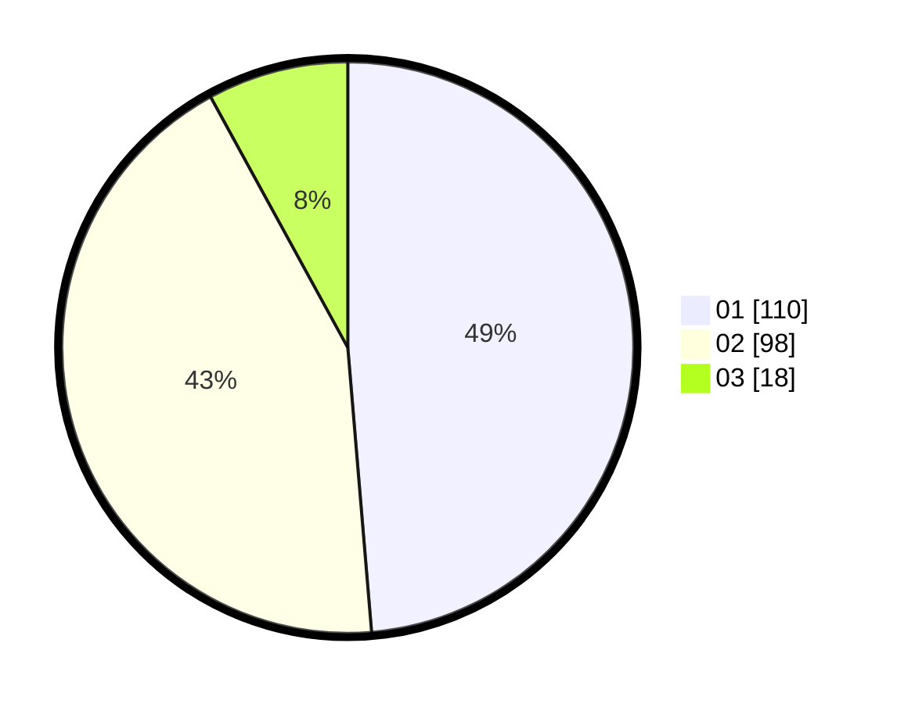

# Hasil

Hasil perolehan suara paslon dapat dilihat pada file paslon-01.txt, paslon-02.txt, dan paslon-03.txt.

Jika tidak ada, artinya data tersebut belum ada pada SIREKAP.

## Perolehan Suara

 * Paslon 01: **110**.
 * Paslon 02: **98**.
 * Paslon 03: **18**.

## Foto C Plano

https://sirekap-obj-formc.kpu.go.id/11a5/pemilu/ppwp/31/72/02/10/01/3172021001007-20240214-202952--9d8de8b4-2bc6-4934-b7f0-bb29a6f0664b.jpg

https://sirekap-obj-formc.kpu.go.id/11a5/pemilu/ppwp/31/72/02/10/01/3172021001007-20240214-203024--5bcef59e-31e4-4125-94c0-063e41183daa.jpg

https://sirekap-obj-formc.kpu.go.id/11a5/pemilu/ppwp/31/72/02/10/01/3172021001007-20240214-203056--74a491ba-ea2c-492d-8321-cd304f1f4daf.jpg

## DATA PEMILIH TETAP

Jumlah pemilih dalam DPT: **287**.
 * L: **148**.
 * P: **139**.

## DATA PENGGUNA HAK PILIH

Jumlah pengguna hak pilih dalam DPT: **210**.
 * L: **105**.
 * P: **105**.

Jumlah pengguna hak pilih dalam DPTb: **0**.
 * L: **0**.
 * P: **0**.

Jumlah pengguna hak pilih dalam DPK: **9**.
 * L: **4**.
 * P: **5**.

Jumlah pengguna hak pilih: **219**.
 * L: **109**.
 * P: **110**.

## JUMLAH SUARA SAH DAN TIDAK SAH

JUMLAH SELURUH SUARA SAH: **226**.

JUMLAH SUARA TIDAK SAH: **5**.

JUMLAH SELURUH SUARA SAH DAN SUARA TIDAK SAH: **231**.
