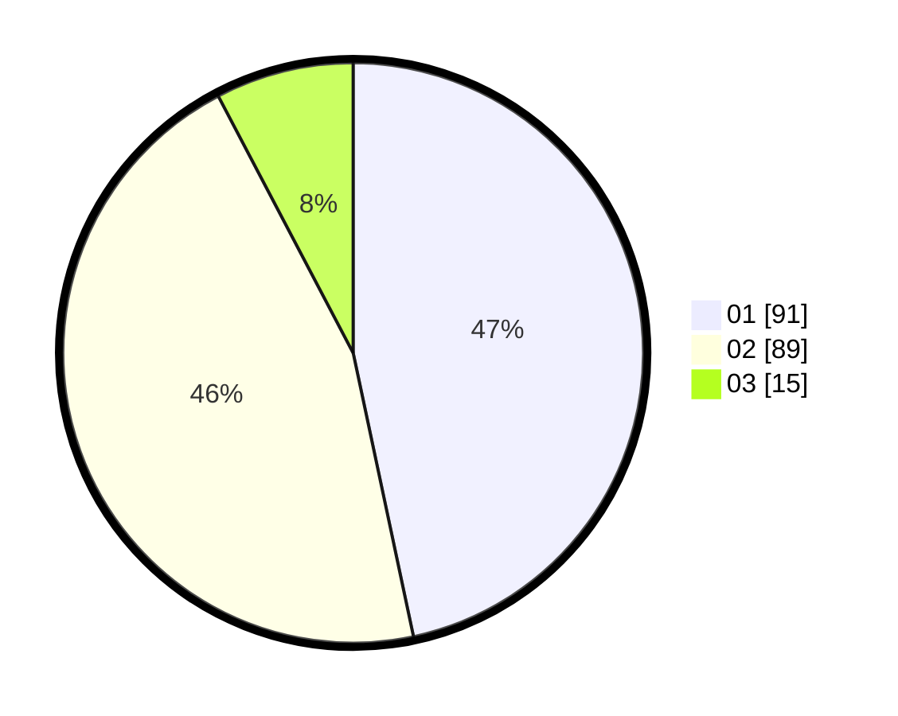

# Hasil

Hasil perolehan suara paslon dapat dilihat pada file paslon-01.txt, paslon-02.txt, dan paslon-03.txt.

Jika tidak ada, artinya data tersebut belum ada pada SIREKAP.

## Perolehan Suara

 * Paslon 01: **91**.
 * Paslon 02: **89**.
 * Paslon 03: **15**.

## Foto C Plano

https://sirekap-obj-formc.kpu.go.id/963c/pemilu/ppwp/31/72/02/10/01/3172021001010-20240215-011143--fadb5b3f-d506-4991-9561-d67042aefdb3.jpg

https://sirekap-obj-formc.kpu.go.id/963c/pemilu/ppwp/31/72/02/10/01/3172021001010-20240215-011308--9e4d048f-6986-4f51-93e3-3076288d6018.jpg

https://sirekap-obj-formc.kpu.go.id/963c/pemilu/ppwp/31/72/02/10/01/3172021001010-20240215-011345--47e84f52-23d3-41af-89e9-1ef4f77a4bc1.jpg

## DATA PEMILIH TETAP

Jumlah pemilih dalam DPT: **286**.
 * L: **149**.
 * P: **137**.

## DATA PENGGUNA HAK PILIH

Jumlah pengguna hak pilih dalam DPT: **196**.
 * L: **89**.
 * P: **107**.

Jumlah pengguna hak pilih dalam DPTb: **0**.
 * L: **0**.
 * P: **0**.

Jumlah pengguna hak pilih dalam DPK: **1**.
 * L: **1**.
 * P: **0**.

Jumlah pengguna hak pilih: **197**.
 * L: **90**.
 * P: **107**.

## JUMLAH SUARA SAH DAN TIDAK SAH

JUMLAH SELURUH SUARA SAH: **195**.

JUMLAH SUARA TIDAK SAH: **2**.

JUMLAH SELURUH SUARA SAH DAN SUARA TIDAK SAH: **197**.
