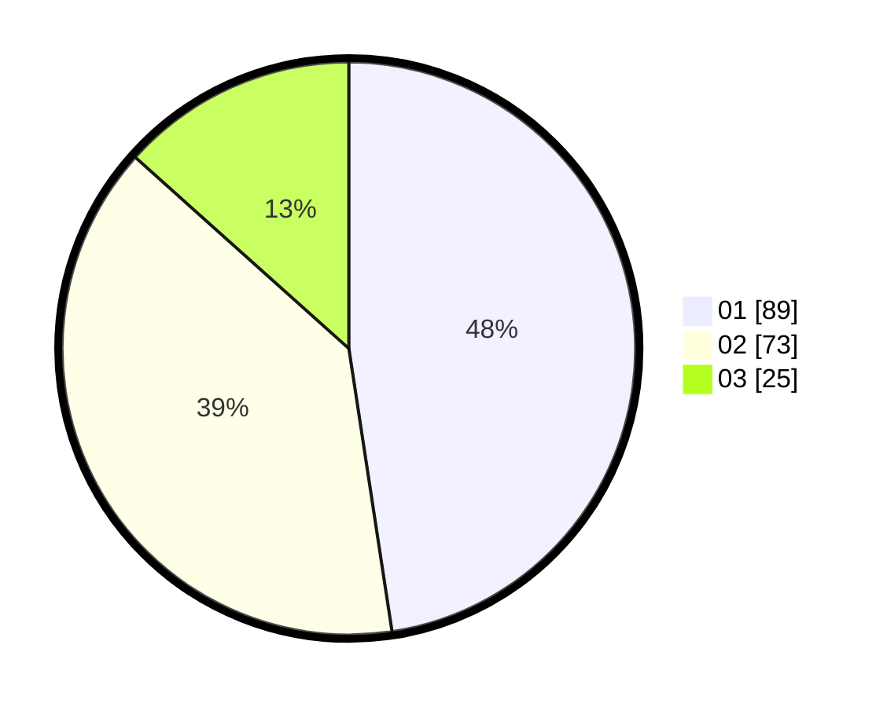

# Hasil

Hasil perolehan suara paslon dapat dilihat pada file paslon-01.txt, paslon-02.txt, dan paslon-03.txt.

Jika tidak ada, artinya data tersebut belum ada pada SIREKAP.

## Perolehan Suara

 * Paslon 01: **89**.
 * Paslon 02: **73**.
 * Paslon 03: **25**.

## Foto C Plano

https://sirekap-obj-formc.kpu.go.id/bf9b/pemilu/ppwp/31/72/02/10/01/3172021001031-20240215-025415--802f8816-0d75-47a8-b629-178e26eb0269.jpg

https://sirekap-obj-formc.kpu.go.id/bf9b/pemilu/ppwp/31/72/02/10/01/3172021001031-20240215-025501--353f92a3-a1ff-4878-ad0c-ab01af28ab85.jpg

https://sirekap-obj-formc.kpu.go.id/bf9b/pemilu/ppwp/31/72/02/10/01/3172021001031-20240215-025541--9cf554c0-ff2c-4945-8b97-d3f1f96adfe2.jpg
