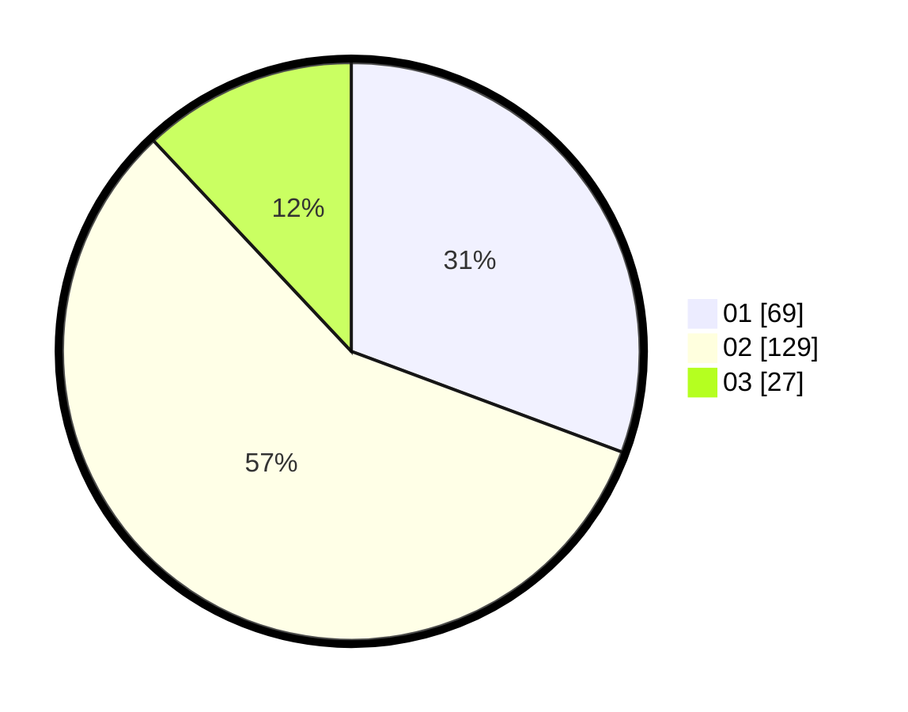

# Hasil

Hasil perolehan suara paslon dapat dilihat pada file paslon-01.txt, paslon-02.txt, dan paslon-03.txt.

Jika tidak ada, artinya data tersebut belum ada pada SIREKAP.

## Perolehan Suara

 * Paslon 01: **69**.
 * Paslon 02: **129**.
 * Paslon 03: **27**.

## Foto C Plano

https://sirekap-obj-formc.kpu.go.id/d6a5/pemilu/ppwp/31/72/02/10/01/3172021001035-20240215-002035--0ed552ed-a82d-4be9-ae5b-64433c3cf7e7.jpg

https://sirekap-obj-formc.kpu.go.id/d6a5/pemilu/ppwp/31/72/02/10/01/3172021001035-20240215-002148--8e86c20b-819b-4990-837d-afd5a40d7472.jpg

https://sirekap-obj-formc.kpu.go.id/d6a5/pemilu/ppwp/31/72/02/10/01/3172021001035-20240215-002248--0ba5f138-c18b-4624-b0a2-6ea14d8f4e60.jpg
