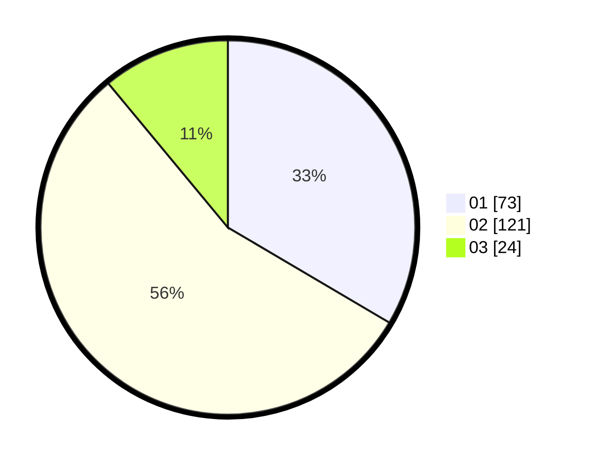

# Hasil

Hasil perolehan suara paslon dapat dilihat pada file paslon-01.txt, paslon-02.txt, dan paslon-03.txt.

Jika tidak ada, artinya data tersebut belum ada pada SIREKAP.

## Perolehan Suara

 * Paslon 01: **73**.
 * Paslon 02: **121**.
 * Paslon 03: **24**.

## Foto C Plano

https://sirekap-obj-formc.kpu.go.id/116f/pemilu/ppwp/31/72/02/10/01/3172021001037-20240214-160115--741f11a1-afb3-43da-bafe-06ec6e8dd472.jpg

https://sirekap-obj-formc.kpu.go.id/116f/pemilu/ppwp/31/72/02/10/01/3172021001037-20240214-155603--927e2eab-a383-42f1-88a6-5c751da2f56a.jpg

https://sirekap-obj-formc.kpu.go.id/116f/pemilu/ppwp/31/72/02/10/01/3172021001037-20240214-155652--19977142-a89e-4449-93f9-6d6bb7d9b027.jpg
