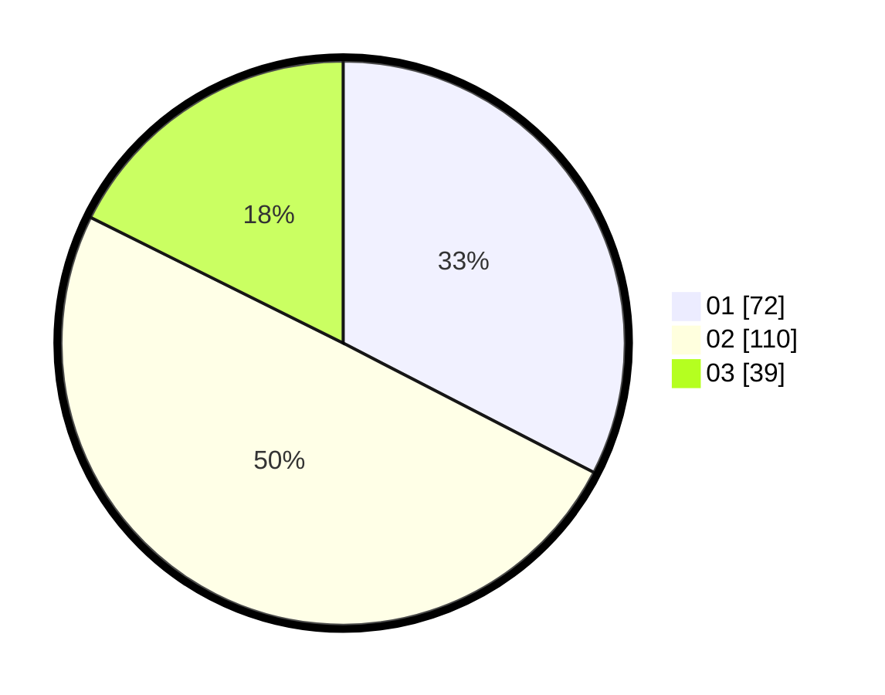

# Hasil

Hasil perolehan suara paslon dapat dilihat pada file paslon-01.txt, paslon-02.txt, dan paslon-03.txt.

Jika tidak ada, artinya data tersebut belum ada pada SIREKAP.

## Perolehan Suara

 * Paslon 01: **72**.
 * Paslon 02: **110**.
 * Paslon 03: **39**.

## Foto C Plano

https://sirekap-obj-formc.kpu.go.id/d730/pemilu/ppwp/31/72/02/10/01/3172021001039-20240217-124211--ffba9753-1097-4b85-bb9a-fb30115e7f9c.jpg

https://sirekap-obj-formc.kpu.go.id/d730/pemilu/ppwp/31/72/02/10/01/3172021001039-20240217-130838--9d8e515f-2b29-4dd7-a039-1ba64f8b4d71.jpg

https://sirekap-obj-formc.kpu.go.id/d730/pemilu/ppwp/31/72/02/10/01/3172021001039-20240217-170444--4e08deba-1757-44e7-805d-3aeb91c551d0.jpg

## DATA PEMILIH TETAP

Jumlah pemilih dalam DPT: **287**.
 * L: **142**.
 * P: **145**.

## DATA PENGGUNA HAK PILIH

Jumlah pengguna hak pilih dalam DPT: **221**.
 * L: **104**.
 * P: **117**.

Jumlah pengguna hak pilih dalam DPTb: **2**.
 * L: **1**.
 * P: **1**.

Jumlah pengguna hak pilih dalam DPK: **1**.
 * L: **1**.
 * P: **0**.

Jumlah pengguna hak pilih: **224**.
 * L: **106**.
 * P: **118**.

## JUMLAH SUARA SAH DAN TIDAK SAH

JUMLAH SELURUH SUARA SAH: **222**.

JUMLAH SUARA TIDAK SAH: **2**.

JUMLAH SELURUH SUARA SAH DAN SUARA TIDAK SAH: **224**.
