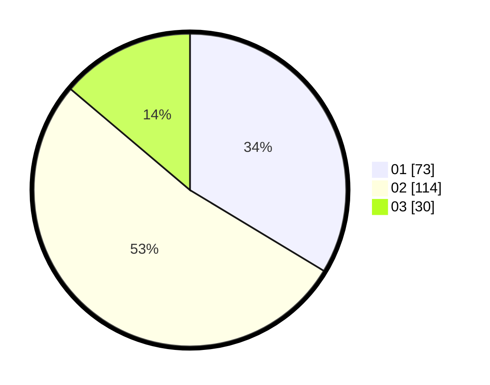

# Hasil

Hasil perolehan suara paslon dapat dilihat pada file paslon-01.txt, paslon-02.txt, dan paslon-03.txt.

Jika tidak ada, artinya data tersebut belum ada pada SIREKAP.

## Perolehan Suara

 * Paslon 01: **73**.
 * Paslon 02: **114**.
 * Paslon 03: **30**.

## Foto C Plano

https://sirekap-obj-formc.kpu.go.id/4773/pemilu/ppwp/31/72/02/10/01/3172021001056-20240217-195800--e481f00f-2571-4641-962f-08c4aa849443.jpg

https://sirekap-obj-formc.kpu.go.id/4773/pemilu/ppwp/31/72/02/10/01/3172021001056-20240217-200623--8d191473-551f-45de-8c4b-9b75eeaa960f.jpg

https://sirekap-obj-formc.kpu.go.id/4773/pemilu/ppwp/31/72/02/10/01/3172021001056-20240217-201007--80b65bd6-dfef-41ca-997a-9c3a388adcc5.jpg

## DATA PEMILIH TETAP

Jumlah pemilih dalam DPT: **299**.
 * L: **140**.
 * P: **159**.

## DATA PENGGUNA HAK PILIH

Jumlah pengguna hak pilih dalam DPT: **218**.
 * L: **98**.
 * P: **120**.

Jumlah pengguna hak pilih dalam DPTb: **0**.
 * L: **0**.
 * P: **0**.

Jumlah pengguna hak pilih dalam DPK: **0**.
 * L: **0**.
 * P: **0**.

Jumlah pengguna hak pilih: **218**.
 * L: **98**.
 * P: **120**.

## JUMLAH SUARA SAH DAN TIDAK SAH

JUMLAH SELURUH SUARA SAH: **217**.

JUMLAH SUARA TIDAK SAH: **1**.

JUMLAH SELURUH SUARA SAH DAN SUARA TIDAK SAH: **218**.
