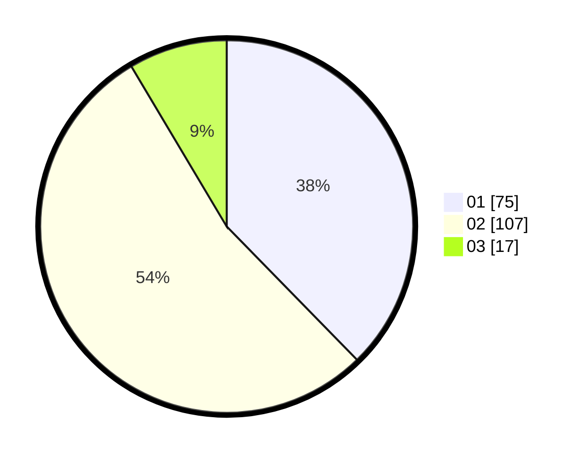

# Hasil

Hasil perolehan suara paslon dapat dilihat pada file paslon-01.txt, paslon-02.txt, dan paslon-03.txt.

Jika tidak ada, artinya data tersebut belum ada pada SIREKAP.

## Perolehan Suara

 * Paslon 01: **75**.
 * Paslon 02: **107**.
 * Paslon 03: **17**.

## Foto C Plano

https://sirekap-obj-formc.kpu.go.id/7d91/pemilu/ppwp/31/72/02/10/01/3172021001057-20240214-224213--5c2764cc-5e65-4554-b987-7eef6ef9056e.jpg

https://sirekap-obj-formc.kpu.go.id/7d91/pemilu/ppwp/31/72/02/10/01/3172021001057-20240214-224253--d12bab49-5098-45a0-82c1-76595d3a0c8e.jpg

https://sirekap-obj-formc.kpu.go.id/7d91/pemilu/ppwp/31/72/02/10/01/3172021001057-20240214-224324--a2bbd643-cfa8-4612-b718-057cd5ad0df5.jpg
