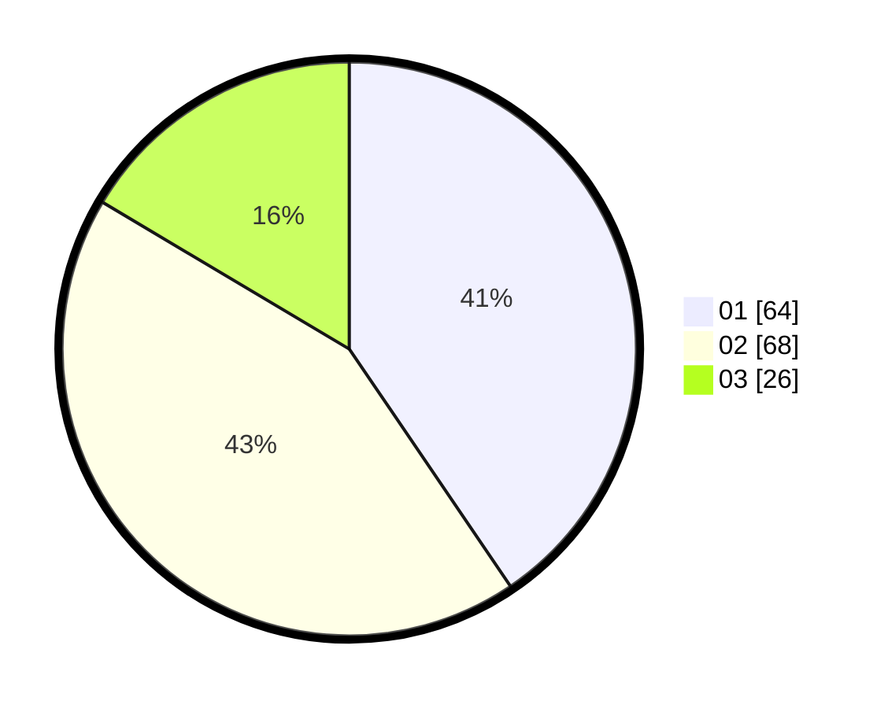

# Hasil

Hasil perolehan suara paslon dapat dilihat pada file paslon-01.txt, paslon-02.txt, dan paslon-03.txt.

Jika tidak ada, artinya data tersebut belum ada pada SIREKAP.

## Perolehan Suara

 * Paslon 01: **64**.
 * Paslon 02: **68**.
 * Paslon 03: **26**.

## Foto C Plano

https://sirekap-obj-formc.kpu.go.id/3205/pemilu/ppwp/31/72/02/10/01/3172021001069-20240215-012600--86f0a9a1-0ea9-41ee-a033-c11ae0381cb9.jpg

https://sirekap-obj-formc.kpu.go.id/3205/pemilu/ppwp/31/72/02/10/01/3172021001069-20240215-012759--9a16b92a-8c03-4b5c-8959-c2c7feb80be0.jpg

https://sirekap-obj-formc.kpu.go.id/3205/pemilu/ppwp/31/72/02/10/01/3172021001069-20240215-013033--b06c5d2d-353c-4192-b572-12aee71c9c8c.jpg

## DATA PEMILIH TETAP

Jumlah pemilih dalam DPT: **253**.
 * L: **130**.
 * P: **123**.

## DATA PENGGUNA HAK PILIH

Jumlah pengguna hak pilih dalam DPT: **159**.
 * L: **74**.
 * P: **85**.

Jumlah pengguna hak pilih dalam DPTb: **2**.
 * L: **2**.
 * P: **0**.

Jumlah pengguna hak pilih dalam DPK: **2**.
 * L: **0**.
 * P: **2**.

Jumlah pengguna hak pilih: **163**.
 * L: **76**.
 * P: **87**.

## JUMLAH SUARA SAH DAN TIDAK SAH

JUMLAH SELURUH SUARA SAH: **158**.

JUMLAH SUARA TIDAK SAH: **5**.

JUMLAH SELURUH SUARA SAH DAN SUARA TIDAK SAH: **163**.
