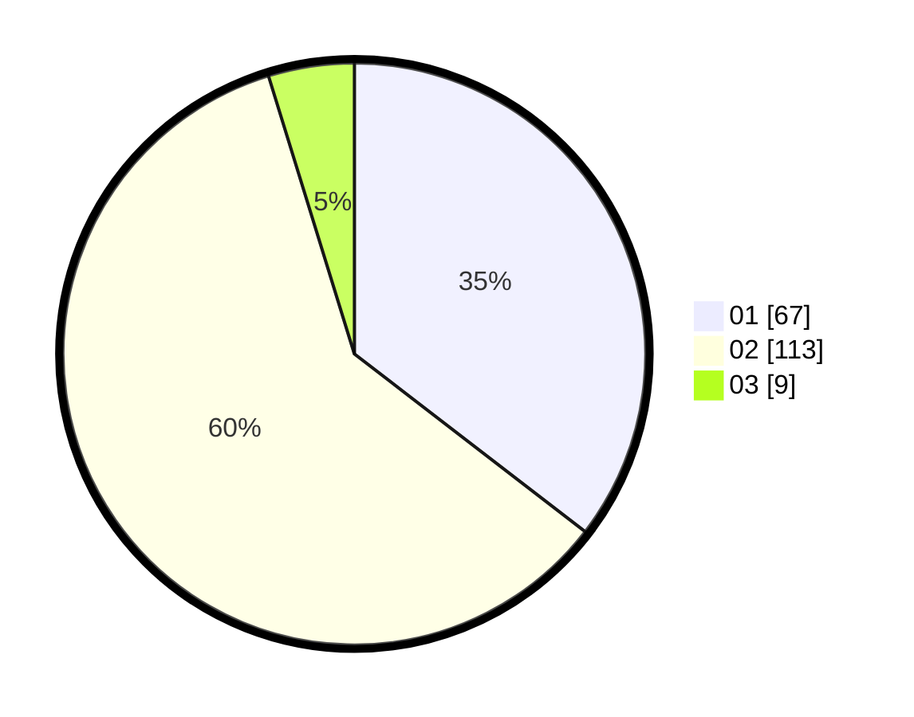

# Hasil

Hasil perolehan suara paslon dapat dilihat pada file paslon-01.txt, paslon-02.txt, dan paslon-03.txt.

Jika tidak ada, artinya data tersebut belum ada pada SIREKAP.

## Perolehan Suara

 * Paslon 01: **67**.
 * Paslon 02: **113**.
 * Paslon 03: **9**.

## Foto C Plano

https://sirekap-obj-formc.kpu.go.id/1bfe/pemilu/ppwp/31/72/02/10/01/3172021001072-20240214-230930--009ad514-b420-4998-998d-a2f40e99a124.jpg

https://sirekap-obj-formc.kpu.go.id/1bfe/pemilu/ppwp/31/72/02/10/01/3172021001072-20240214-231100--9e9a7036-a15c-49c9-bc5d-676055cc386a.jpg

https://sirekap-obj-formc.kpu.go.id/1bfe/pemilu/ppwp/31/72/02/10/01/3172021001072-20240214-231141--cf1beff4-8f5a-4681-8be2-8745b140e177.jpg

## DATA PEMILIH TETAP

Jumlah pemilih dalam DPT: **276**.
 * L: **138**.
 * P: **138**.

## DATA PENGGUNA HAK PILIH

Jumlah pengguna hak pilih dalam DPT: **192**.
 * L: **89**.
 * P: **103**.

Jumlah pengguna hak pilih dalam DPTb: **0**.
 * L: **0**.
 * P: **0**.

Jumlah pengguna hak pilih dalam DPK: **3**.
 * L: **0**.
 * P: **3**.

Jumlah pengguna hak pilih: **195**.
 * L: **89**.
 * P: **106**.

## JUMLAH SUARA SAH DAN TIDAK SAH

JUMLAH SELURUH SUARA SAH: **189**.

JUMLAH SUARA TIDAK SAH: **6**.

JUMLAH SELURUH SUARA SAH DAN SUARA TIDAK SAH: **195**.
